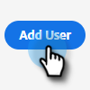
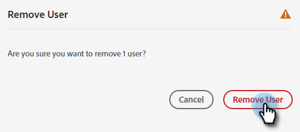

# Lägg till eller ta bort chattanvändare {#add-or-remove-chat-users}

Följ stegen nedan för att lägga till eller ta bort chattanvändare.

## Lägg till en chattanvändare {#add-a-chat-user}

1. Logga in på [Adobe Admin Console](https://adminconsole.adobe.com/).

   

1. Klicka **Dynamiskt chatt**.

   

   >[!NOTE]
   >
   >Om du har fler än en Marketo-prenumeration väljer du en före nästa steg.

1. Klicka på **Användare** -fliken.

   

1. Klicka på **Lägg till användare** -knappen.

   

1. Ange namn, användargrupp eller e-postadress för den användare som du vill lägga till. Förnamn och efternamn är valfria.

   

1. Klicka på **+** och välj önskad produktprofil.

   

1. Klicka **Spara**.

   

## Lägg till dynamisk chattåtkomst till Marketo-rollen {#add-dynamic-chat-access-to-marketo-role}

Om den nyligen tillagda chattanvändarens Marketo-roll inte redan har dynamisk chatt, så här lägger du till den.

1. I Marketo klickar du på **Administratör** och markera **Användare och roller**.

   

1. Klicka på **Roller** -fliken.

   

1. Välj den roll du vill ändra i listan och klicka på **Redigera roll**.

   

1. Välj **Åtkomst till dynamiskt chatt** och klicka **Spara**.

   

## Ta bort en chattanvändare {#remove-a-chat-user}

1. Logga in på [Adobe Admin Console](https://adminconsole.adobe.com/).

   

1. Klicka **Dynamiskt chatt**.

   

   >[!NOTE]
   >
   >Om du har fler än en Marketo-prenumeration väljer du en före nästa steg).

1. Klicka på **Användare** -fliken.

   

1. Markera den användare som du vill ta bort.

   

1. Klicka på **Ta bort användare** -knappen.

   

1. Klicka **Ta bort användare** för att bekräfta.

   

>[!MORELIKETHIS]
>
>* [Adobe Admin Console-användare](https://helpx.adobe.com/enterprise/using/users.html)
>* [Hantera användare individuellt](https://helpx.adobe.com/enterprise/using/manage-users-individually.html)

