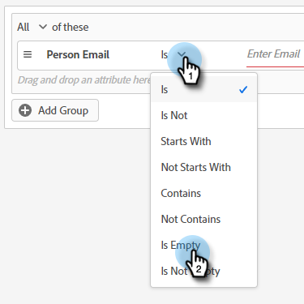

# Målgruppskriterier {#audience-criteria}

På samma sätt som med Marketo Engage smarta listor kan du definiera målgruppen med hjälp av attribut för målgruppskriterier. Du kan rikta in dig på kända eller okända personer med hjälp av attribut för härkomst, person eller företag (eller en kombination av dessa).

## Prioritet {#priority}

Prioritet avgör vilken dialog ett lead får om de kvalificerar sig för mer än en. Den etableras när du [skapar din dialogruta](/help/marketo/product-docs/demand-generation/dynamic-chat/automated-chat/create-a-dialogue.md){target="_blank"} första gången. Du kan ändra prioriteten för en befintlig dialogruta genom att öppna den och gå till **[!UICONTROL Dialogue Details]** på fliken Målgruppskriterier.

## Händelser {#events}

Med händelser kan ni rikta in er på besökarna baserat på hur mycket de rullar eller hur länge de finns på sidan/webbplatsen. I exemplet nedan riktar vi oss till besökare som har varit på en viss sida i mer än 20 sekunder.

1. Hämta **[!UICONTROL Time on Page]**-händelsen och dra den åt höger.

   

1. Ställ in tiden [!UICONTROL Greater Than] till 20 sekunder.

   

1. Lägg till URL-adressen för den önskade sidan i avsnittet [[!UICONTROL Target]](#target).

   

## Attribut {#attributes}

**Kända personer**

Det finns _många_ attributkombinationer att välja mellan. I exemplet nedan riktar vi oss till alla kända personer i Kalifornien som arbetar på ett företag med över 50 anställda.

1. Ta attributet **[!UICONTROL Person State]** och dra det åt höger.

   

1. _[!UICONTROL Is]_är inställt som standard. I fältet Välj värden skriver du in CA (du kan också klicka på listrutan och välja från listan).

   

1. Ta attributet **[!UICONTROL Company Size]** och dra det till den plats där det står _dra och släpp ett attribut här_.

   

   >[!NOTE]
   >
   >Du kan också välja ett attribut genom att klicka på dess **+**-ikon.

1. Klicka på operatorlistrutan och välj **[!UICONTROL Greater Than]**.

   

1. Skriv 50 och klicka någon annanstans på skärmen för att spara.

   

Och det är allt!

**Anonyma personer**

Det finns ett enkelt sätt att specifikt rikta in sig på personer som inte finns i din databas än. I det här exemplet riktar vi oss till alla anonyma personer som finns i New York.

1. Ta attributet **[!UICONTROL Person Email]** och dra det åt höger.

   

1. Klicka på operatorlistrutan och välj **[!UICONTROL Is Empty]**.

   

1. Ta attributet **[!UICONTROL Inferred State]** och dra det till den plats där det står _dra och släpp ett attribut här_.

   

   >[!NOTE]
   >
   >[Munchkin](/help/marketo/product-docs/administration/additional-integrations/add-munchkin-tracking-code-to-your-website.md){target="_blank"} cookies och placerar dem i systemet när någon besöker din webbplats. Vi slår upp deras IP-adresser i en särskild databas och drar nytta av all slags bra information.

1. _[!UICONTROL Is]_är inställt som standard. I fältet Välj värden skriver du NY (du kan också klicka på listrutan och välja från listan).

   

## medlemskap {#membership}

Använd Marketo Engage Smart Lists för er målgrupp.

>[!AVAILABILITY]
>
>Medlem i kriterierna Smart List eller Medlem i List kräver Dynamic Chat Prime. Kontakta Adobe Account Team (din kontoansvarige) för mer information.

1. Under Medlemskap tar du **[!UICONTROL Member of Smart List]** och släpper det på arbetsytan.

   

1. Välj önskad smart lista.

   

## Lägg till grupper {#add-groups}

Du kan också gruppera attribut om du vill ha alla attribut tillsammans med&quot;all eller något&quot; av andra. Du kan lägga till flera grupper.

## Target {#target}

Här anger du de URL:er som du vill att en viss dialogruta ska visas på. Du kan också lägga till undantag.

Godtagbara format:

* `http://website.com`
* `https://*.website.com`
* `http://website.com/folder/*`
* `https://*.website.com/folder/*`

>[!NOTE]
>
>* Om du använder en asterisk fungerar det som ett jokertecken för&quot;catch all&quot;. `https://*.website.com` placerar dialogrutan på varje sida på webbplatsen, inklusive underdomäner (t.ex. `support.website.com`). Och `https://website.com/folder/*` placerar dialogrutan på varje HTML-sida i efterföljande mapp (t.ex. i det här fallet säger vi att mappen är &quot;sport&quot;, så här: website.com/sports/baseball.html, website.com/sports/football.html osv.).
>
>* URL-parametrar stöds inte just nu.

**Undantag**

Använd undantag för att se till att dialogrutan _inte_ visas på en viss sida/ett visst område på webbplatsen. Undantag har samma format som inkluderingar.

>[!MORELIKETHIS]
>
>* [Skapa en dialogruta](/help/marketo/product-docs/demand-generation/dynamic-chat/automated-chat/create-a-dialogue.md){target="_blank"}
>* [Strömma Designer](/help/marketo/product-docs/demand-generation/dynamic-chat/automated-chat/stream-designer.md){target="_blank"}
