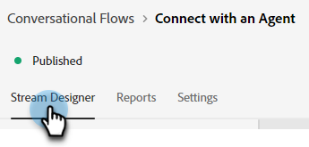
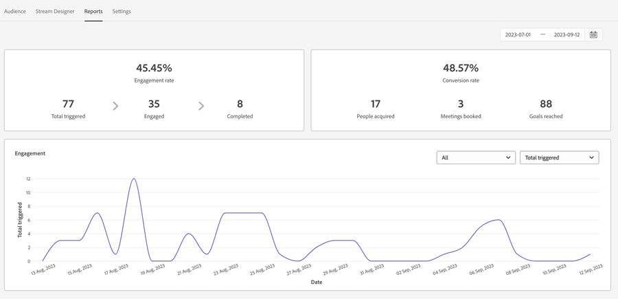

# Översikt över konversationsflöde {#conversational-flow-overview}

Utforma ett konversationsflöde och aktivera det för alla besökare baserat på en specifik åtgärd (t.ex. genom att klicka på en call-to-action-knapp, vid sidinläsning, hur lång tid som tillbringats på sidan).

## Dialogrutor jämfört med konversationsflöden {#dialogues-vs-conversational-flows}

Dialogrutor och konversationsflöden har flera likheter, men de har två separata funktioner.

<table>
 <tbody>
  <tr>
   <th style="width:50%">Dialogrutor</th>
   <th style="width:50%">Konversationsflöden</th>
  </tr>
  <tr>
   <td>Symboler är riktade - du utformar en konversation för en viss sida och målgrupp baserat på de parametrar du implementerat.</td>
   <td>Konversationsflöden utlöses - Du utformar en konversation som kan utlösas baserat på en besökares åtgärd, som att fylla i ett formulär, klicka på en länk osv.</td>
  </tr>
   <tr>
   <td>Stöds endast i Chatbot-gränssnittet.</td>
   <td>Stöds för närvarande i ett popup-gränssnitt med fler gränssnitt planerade.</td>
  </tr>
  </tr>
   <tr>
   <td>Flera dialogrutor kan skapas för samma segment av leads, med en prioritetsordning så att varje besökare ser dialogrutan i sekvens efter prioritet när de fortsätter att engagera.</td>
   <td>Konversationsflöden har ingen prioritetsordning och kan aktiveras hur många gånger som helst av samma lead baserat på vad call-to-action fastställer.</td>
  </tr>
  <tr>
   <td>Chatbot-konversationer drivs av Dialogs.</td>
   <td><a href="/help/marketo/product-docs/demand-generation/dynamic-chat/automated-chat/conversational-flow-settings-for-marketo-engage-forms.md" target="_blank">Konversationsbaserade Forms</a> i Marketo Engage drivs av konversationsflöden.</td>
  </tr>
 </tbody>
</table>

## Stream Designer Tab {#stream-designer-tab}

Stream Designer for Conversational Flows är nästan identisk med den för Dialogs. [Läs allt här](/help/marketo/product-docs/demand-generation/dynamic-chat/automated-chat/stream-designer.md){target="_blank"}.

## Fliken Rapporter {#reports-tab}

På fliken Rapporter kan du se mätvärden om hur bra ditt konversationsflöde fungerar.

Visa engagemangsfrekvens, konverteringsgrad, filtrera efter kända och/eller okända besökare och mycket annat.

## Fliken Inställningar {#settings-tab}

I den övre halvan av fliken Inställningar kan du uppdatera konversationsflödets namn, lägga till en valfri beskrivning och ändra språket.

>[!NOTE]
>
>Om du väljer ett annat språk ändras endast systemtextens språk. Du ansvarar för att översätta innehåll.

### Konversationer SDK {#conversations-sdk}

Anpassa konversationsutlösaren (kallas även Konversationer SDK) i den nedre delen av fliken Inställningar. Du kan bestämma om konversationen ska utlösas på webbplatsen när en besökare klickar på en länk eller vid sidinläsning.

>[!TIP]
>
>Se [Konversationer SDK](https://experienceleague.adobe.com/tools/marketo-dynamic-chatbot/conversations-sdk/?lang=sv-SE){target="_blank"} in action!

>[!MORELIKETHIS]
>
>[Skapa ett konversationsflöde](/help/marketo/product-docs/demand-generation/dynamic-chat/automated-chat/create-a-conversational-flow.md){target="_blank"}
