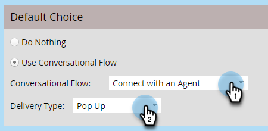
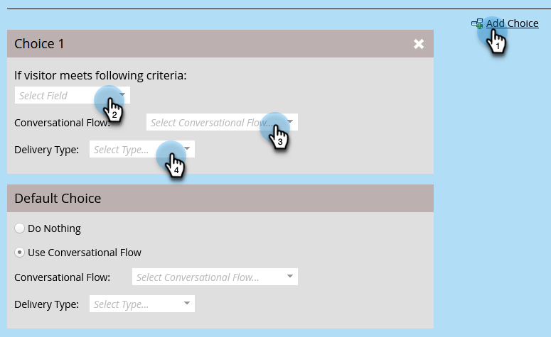

# Konversationsflödesinställningar för Marketo Engage Forms{#conversational-flow-settings-for-marketo-engage-forms}

Förvandla Marketo Engage Forms till en dialog genom att integrera dem med Dynamic Chat Conversational Flows. Hitta leads direkt med hjälp av formulärdata eller Smart List-medlemskap för mötesbokningar, rapporter eller anpassade mål.

>[!AVAILABILITY]
>
>Medlem i kriterierna Smart List eller Medlem i List kräver Dynamic Chat Prime. Kontakta Adobe Account Team (din kontoansvarige) för mer information.

1. Hitta och välj ett formulär (eller skapa ett nytt).

   

1. Klicka på **[!UICONTROL Edit Draft]**.

   

1. Klicka på **[!UICONTROL Form Settings]** och sedan **[!UICONTROL Settings]** på formulärredigeringssidan.

   

1. Klicka på skjutreglaget **[!UICONTROL Conversational Flow Settings]** för att aktivera.

   

1. Ett standardalternativ visas. Välj din inställning. I detta exempel väljer vi **[!UICONTROL Use Conversational Flow]**.

   

1. Markera önskad **[!UICONTROL Conversational Flow]** och **[!UICONTROL Delivery Type]**.

   

   >[!NOTE]
   >
   >[Läs mer om konversationsflöden](/help/marketo/product-docs/demand-generation/dynamic-chat/automated-chat/conversational-flow-overview.md){target="_blank"}

   **VALFRITT STEG**: Du kan klicka på **[!UICONTROL Add Choice]** om du vill rikta chattbesökare som uppfyller ett visst villkor. Du kan lägga till upp till nio alternativ för totalt tio.

   

   >[!NOTE]
   >
   >Besökarens webbläsare måste vara en känd person som cookie innan formuläret skickas in för att bli berättigad till medlem i en statisk/smart lista.

   **VALFRITT STEG**: Klicka på signaturen **+** i varje steg om du vill lägga till fler attribut, så att du kan begränsa målgruppen (attributen är de fält som du har valt för formuläret). I detta exempel riktar vi oss till Adobe Technical Writers i Kalifornien.

   

   >[!NOTE]
   >
   >Med&quot;all&quot; avses att alla attribut måste vara uppfyllda för att kvalificera sig. Med&quot;any&quot; som villkorslogik betyder det att alla attribut är tillräckliga.

   **VALFRITT STEG**: Om du lägger till två eller flera alternativ kan du ändra ordning på dem genom att klicka på deras upp-/nedpilar.

   

1. Klicka på **[!UICONTROL Finish]** när du är klar.

   
