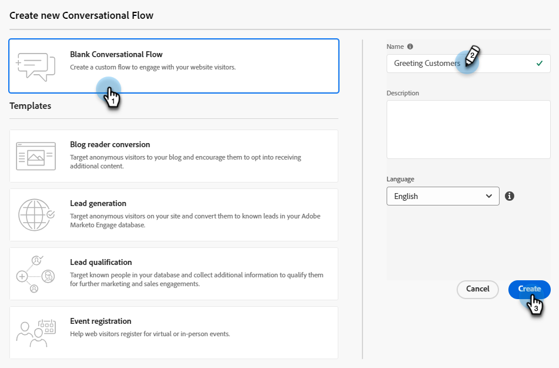

# Skapa ett konversationsflöde {#create-a-conversational-flow}

Så här skapar du ett nytt konversationsflöde.

1. Klicka på [!UICONTROL Automated Chat] under **[!UICONTROL Conversational Flows]**.

   

1. Klicka på **[!UICONTROL Create Conversational Flow]**.

   

1. Välj ett tomt konversationsflöde eller någon av de förifyllda mallarna. Ange ett namn (beskrivningen är valfri), ändra språket (valfritt) och klicka på **[!UICONTROL Create]**.

   

   >[!NOTE]
   >
   >Detta ändrar endast systemtextens språk. Du ansvarar för att översätta innehåll.

1. Precis som i dialogrutor är det nu dags att [skapa en ström](/help/marketo/product-docs/demand-generation/dynamic-chat/automated-chat/stream-designer.md#create-a-stream){target="_blank"}.

>[!MORELIKETHIS]
>
>[Konversationsflöde - översikt](/help/marketo/product-docs/demand-generation/dynamic-chat/automated-chat/conversational-flow-overview.md){target="_blank"}
