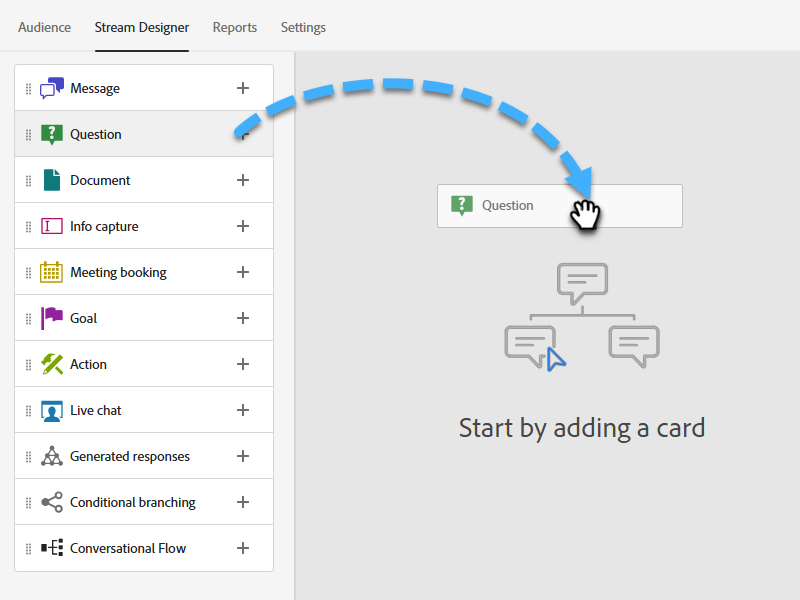
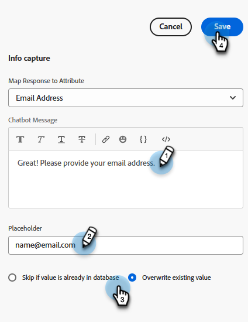

# Stream Designer {#stream-designer}

Det finns _många_ möjliga kombinationer av strömmar. Den här artikeln innehåller ett exempel där marknadsföraren frågar besökaren om han eller hon har några produktfrågor. Om ja, kan besökaren boka ett möte. Om nej, ges besökaren möjlighet att ansluta sig till en sändlista för framtida korrespondens. De erbjuds också en kostnadsfri PDF. Det slutliga målet är antingen att schemalägga en avtalad tid eller att samla in besökarens e-post.

>[!PREREQUISITES]
>
>Innan du kan använda dokumentkortet måste du [konfigurera](/help/marketo/product-docs/demand-generation/dynamic-chat/integrations/adobe-pdf-embed-api.md){target="_blank"} på ditt Adobe-konto.

## Stream Designer-kort {#stream-designer-cards}

Stream Designer innehåller flera kort som du kan lägga till för att forma chattkonversationen.

<table>
 <tr>
  <td style="width:25%"><strong>Meddelande</strong></td>
  <td>Använd det här alternativet om du vill göra en programsats utan något svar (t.ex. "Hi! Alla artiklar är 25 % rabatt idag med koden SAVE25").
</td>
 </tr>
 <tr>
  <td style="width:25%"><strong>Fråga</strong></td>
  <td>Använd detta när du vill ställa en flervalsfråga, där du kan ge tillgängliga svar (t.ex. vilken typ av fordon är du intresserad av? Svar = SUV, Compact, Truck osv.).</td>
 </tr>
 <tr>
  <td style="width:25%"><strong>Dokument</strong></td>
  <td>Gör att du kan bädda in PDF-dokument i dialogrutor och spåra besökares engagemang i dokument (hur många sidor som visades, om dokumentet hämtades och/eller eventuella söktermer som användes).</td>
 </tr>
 <tr>
  <td style="width:25%"><strong>Inhämtning av information</strong></td>
  <td>Använd när du vill samla in information (t.ex. namn, e-postadress, befattning osv.). När du har valt vilket fält som svaren ska tilldelas till kan du välja mellan att låta besökartypen i svaret eller välja alternativ i en lista som du bestämmer (tips: det senare kan hjälpa till med att rensa databasen). Du kan också välja att skriva över alla data som du har angett för dem med deras svar, eller hoppa över frågan helt om du redan har ett värde för dem.</td>
 </tr>
 <tr>
  <td style="width:25%"><strong>Mötesbokning</strong></td>
  <td>Ger besökaren en kalender med tillgängliga datum för att schemalägga ett möte. Välj kalendertillgänglighet via resursallokering, en specifik agent eller med anpassade regler. Klicka <b>Lägg till attribut</b> om du vill hämta agentens namn eller e-postadress och tilldela den till chattbesökarens personpost för framtida frågor (tips: skapa en <a href="/help/marketo/product-docs/administration/field-management/create-a-custom-field-in-marketo.md" target="_blank">anpassat fält</a> för att mappa agentens information till så att den inte skriver över ett standardfält i Marketo Engage).</td>
 </tr>
 <tr>
  <td style="width:25%"><strong>Mål</strong></td>
  <td>Det här är det enda kortet som besökarna inte ser. Det är upp till dig att avgöra vid vilken punkt ett mål uppnås i den specifika chatten (t.ex. om du vill samla in besökarens e-postadress placerar du målkortet omedelbart efter Info Capture i strömmen).</td>
 </tr>
 <tr>
  <td style="width:25%"><strong>Åtgärd*</strong></td>
  <td>Liknar dolda fält i ett formulär, med åtgärdskortet kan du fylla i alla lead- eller företagsattribut (som har en <a href="/help/marketo/product-docs/administration/field-management/custom-field-type-glossary.md#string">strängdatatyp</a>) med implicita värden som du vill hämta mot en lead-post. Du kan lägga till åtgärdskortet när som helst i konversationen och uppdatera respektive attribut med ett värde eller inbyggda tokens som automatiskt fyller i respektive värde.
  
<i>* Det här kortet kräver Dynamic Chat Prime. Kontakta kontoteamet (din kontoansvarige) för mer information.</i></td>
 </tr>
 <tr>
  <td style="width:25%"><strong>Live-chatt</strong></td>
  <td>Använd chattkortet när du vill att besökarna ska chatta med en live-agent.
  <li>Chattkortet måste vara det sista kortet i grenen.</li>
  <li>Besökarna dirigeras till en agent så snart de kommer till kortet i strömmen, så vi rekommenderar att du före kortet tillfrågar besökarna om de vill chatta med en Live-agent.</li></td>
 </tr>
 <tr>
  <td style="width:25%"><strong>Genererade svar*</strong></td>
  <td>Skapa ett meddelande till besökaren när de når en viss punkt i konversationen. Ställ in ett antal frågor som de kan ställa på en gång för att få fram den önskade nyckelprestandaindikatorn.
  
<i>* Det här kortet kräver Dynamic Chat Prime. Kontakta kontoteamet (din kontoansvarige) för mer information.</i></td>
 </tr>
 <tr>
  <td style="width:25%"><strong>Villkorlig förgrening</strong></td>
  <td>Skapa grenar i Dialogrutorna baserat på olika villkor. Presentera olika innehåll för olika personer i samma dialog baserat på lead- och företagsattribut i Marketo Engage.</td>
 </tr>
</table>

## Stream Designer-ikoner {#stream-designer-icons}

I det övre högra hörnet av Stream Designer visas en handfull ikoner. Så här gör de.

<table>
 <tr>
  <td style="width:10%"></td>
  <td>Zoomar in, skapar större kort</td>
 </tr>
 <tr>
  <td style="width:10%"></td>
  <td>Zoomar ut, skapa mindre kort</td>
 </tr>
 <tr>
  <td style="width:10%"></td>
  <td>Öppnar ett fönster där du kan testa chatten (tryck på samma knapp för att stänga)</td>
 </tr>
 <tr>
  <td style="width:10%"></td>
  <td>Gör att du kan söka efter korttyper eller innehåll i strömmen</td>
 </tr>
 <tr>
  <td style="width:10%"></td>
  <td>Ordnar alla kort i strömmen</td>
 </tr>
</table>

## Skapa en ström {#create-a-stream}

Du kan skapa strömmar för dialogrutor eller [Forms](/help/marketo/product-docs/demand-generation/dynamic-chat/automated-chat/conversational-flow-overview.md){target="_blank"}. I det här exemplet skapar vi en för en dialogruta.

1. Efter att du [skapade din dialogruta](/help/marketo/product-docs/demand-generation/dynamic-chat/automated-chat/create-a-dialogue.md){target="_blank"}klickar du på **[!UICONTROL Stream Designer]** -fliken.

   

1. Dra och släpp [!UICONTROL Question] kort.

   

1. Under [!UICONTROL Chatbot Response], säg din fråga så som du vill.

   

   >[!TIP]
   >
   >Du kan personalisera upplevelsen för kända chattbesökare genom att använda variabler (t.ex. Hello `{{lead.leadFirstName:""}}`). Klicka bara på klammerparentesen till höger och gör ditt val. Lägg till ett standardvärde mellan offerterna om du vill att anonyma besökare ska se något generiskt (t.ex. Hello `{{lead.leadFirstName:"there"}}`).

   >[!NOTE]
   >
   >Poke är som standard aktiverat, vilket innebär att den inledande frågan visas bredvid chattikonen utan att besökaren behöver klicka på den för att se den. Poke är bara tillgängligt på det första kortet i konversationen.

1. Ange dina användarsvar och klicka på **[!UICONTROL Save]**.

   

   >[!NOTE]
   >
   >**[!UICONTROL Edit Stored Values]** är ett valfritt steg för dem som vill lagra ett annat värde i databasen än vad som visas för besökare i chattbot för mappade attribut på frågekortet (t.ex.: besökaren ser &quot;Sökmotoroptimering&quot;, du lagrar värdet som &quot;SEO&quot;).

1. För Ja vill vi schemalägga en avtalad tid, så under det alternativet drar du över schemaläggarkortet för avtalad tid.

   

1. Klicka på i kolumnen till höger **[!UICONTROL Save]**.

   

1. Eftersom det är ett mål drar du [!UICONTROL Goal] kortet under Avtalets schemaläggare.

   

1. Namnge målet (eller välj ett befintligt) och klicka på **[!UICONTROL Save]**.

   

1. För&quot;Nej&quot; vill vi se om de kommer att gå med i e-postlistan, så under det alternativet drar vi över ett annat [!UICONTROL Question] kort.

   

1. Ange ditt svar och lägg till svarsalternativ för besökaren. Klicka **[!UICONTROL Save]** när det är klart.

   

   >[!NOTE]
   >
   >Du kan lägga till fler svar genom att klicka på **[!UICONTROL Add Response]**.

1. Under svaret&quot;Ja&quot; drar du över Info Capture-kortet så att du kan samla in besökarens e-post.

   

1. Klicka på **[!UICONTROL Type]** nedrullningsbar meny och välj **[!UICONTROL Email]**.

   

1. Ange ett chattbot-meddelande och en platshållare. Kontrollera att attributet är mappat till rätt fält i Marketo Engage och klicka på **[!UICONTROL Save]**.

   

   <table>
    <tr>
     <td style="width:30%"><strong>Typ</strong></td>
     <td>Den typ av information som du vill hämta: Telefon, Text, E-post.</td>
    </tr>
    <tr>
     <td style="width:30%"><strong>Chatbot-meddelande</strong></td>
     <td>Det meddelande besökaren ser där han/hon uppmanas att ange informationen.</td>
    </tr>
    <tr>
     <td style="width:30%"><strong>Platshållare</strong></td>
     <td>Exempeltext som hjälper besökaren att se vad han/hon ska ange.</td>
    </tr>
    <tr>
     <td style="width:30%"><strong>Mappa svar till attribut</strong></td>
     <td>Gör att du kan synkronisera besökarens svar till motsvarande fält i personposten i din Marketo Engage-prenumeration.</td>
    </tr>
   </table>

1. Eftersom det är ett mål att samla in deras e-post drar du [!UICONTROL Goal] kortet under Info Capture.

   

1. Namnge målet (eller välj ett befintligt) och klicka på **[!UICONTROL Save]**.

   

1. Kom ihåg att lägga till ett svar om de säger&quot;Nej&quot;. Ett alternativ är att dra ett meddelandekort nedan och säga&quot;Tack ändå&quot;. Men i det här exemplet ger vi dem ett kostnadsfritt PDF-dokument istället.

   

1. I det här exemplet skapar vi ett nytt dokument. Ge den ett namn, ange URL:en till PDF som du redan har en värdserver och klicka på **[!UICONTROL Save]**.

   

1. Välj **[!UICONTROL Preview]** om du vill förhandsgranska dialogrutan.

   

1. När du är klar att aktivera dialogrutan klickar du på **[!UICONTROL Publish]**.

   

>[!NOTE]
>
>Innan du klickar [!UICONTROL Publish], kom ihåg att se till att du [angett mål-URL:er](/help/marketo/product-docs/demand-generation/dynamic-chat/automated-chat/audience-criteria.md#target){target="_blank"}.

>[!MORELIKETHIS]
>
>* [Skapa en dialogruta](/help/marketo/product-docs/demand-generation/dynamic-chat/automated-chat/create-a-dialogue.md){target="_blank"}
>* [Målgruppskriterier](/help/marketo/product-docs/demand-generation/dynamic-chat/automated-chat/audience-criteria.md){target="_blank"}
>* [Adobe PDF Embed API](/help/marketo/product-docs/demand-generation/dynamic-chat/integrations/adobe-pdf-embed-api.md){target="_blank"}
