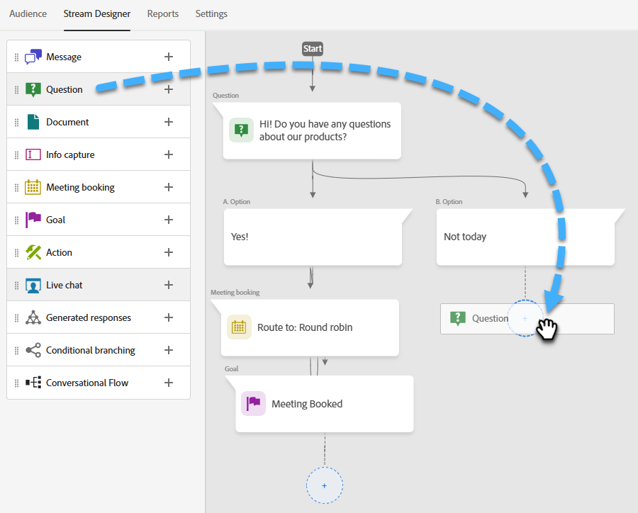
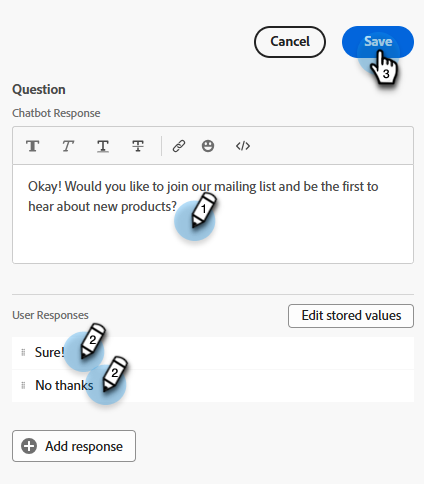

# Stream Designer {#stream-designer}

Det finns _många_ möjliga kombinationer av strömmar. Den här artikeln innehåller ett exempel där marknadsföraren frågar besökaren om han eller hon har några produktfrågor. Om ja, kan besökaren boka ett möte. Om nej, ges besökaren möjlighet att ansluta sig till en sändlista för framtida korrespondens. De erbjuds också en kostnadsfri PDF. Det slutliga målet är antingen att schemalägga en avtalad tid eller att samla in besökarens e-post.

>[!PREREQUISITES]
>
>Innan du kan använda dokumentkortet måste du [konfigurera det](/help/marketo/product-docs/demand-generation/dynamic-chat/integrations/adobe-pdf-embed-api.md){target="_blank"} i ditt Adobe-konto.

## Strömma Designer-kort {#stream-designer-cards}

Stream Designer innehåller flera kort som du kan lägga till för att forma chattkonversationen.

<table>
 <tr>
  <td style="width:25%"><strong>Meddelande</strong></td>
  <td style="width:75%">Använd det här alternativet om du vill göra en programsats utan något svar (t.ex. "Hi! Alla artiklar är 25 % rabatt idag med koden SAVE25").
</td>
 </tr>
 <tr>
  <td style="width:25%"><strong>Fråga</strong></td>
  <td>Använd detta när du vill ställa en flervalsfråga, där du kan ge tillgängliga svar (t.ex. vilken typ av fordon är du intresserad av? Svar = SUV, Compact, Truck osv.).</td>
 </tr>
 <tr>
  <td style="width:25%"><strong>Dokument</strong></td>
  <td>Gör att du kan bädda in PDF-dokument i dialogrutor och spåra besökarnas engagemang (hur många sidor som visades, om dokumentet hämtades och/eller eventuella söktermer som användes).</td>
 </tr>
 <tr>
  <td style="width:25%"><strong>Inhämtning av information</strong></td>
  <td>Använd när du vill samla in information (t.ex. namn, e-postadress, befattning osv.). När du har valt vilket fält som svaren ska tilldelas till kan du välja mellan att låta besökartypen i svaret eller välja alternativ i en lista som du bestämmer (tips: det senare kan hjälpa till med att rensa databasen). Du kan också välja att skriva över alla data som du har angett för dem med deras svar, eller hoppa över frågan helt om du redan har ett värde för dem.</td>
 </tr>
 <tr>
  <td style="width:25%"><strong>Mötesbokning</strong></td>
  <td>Ger besökaren en kalender med tillgängliga datum för att schemalägga ett möte. Välj kalendertillgänglighet via resursallokering, en specifik agent eller med anpassade regler. Klicka på <b>Lägg till attribut</b> om du vill hämta agentens namn eller e-postadress och tilldela den till chattbesökarens personpost för framtida frågor (tips: skapa ett <a href="/help/marketo/product-docs/administration/field-management/create-a-custom-field-in-marketo.md" target="_blank">anpassat fält</a> för att mappa agentens information till så att den inte skriver över ett Marketo Engage-standardfält).</td>
 </tr>
 <tr>
  <td style="width:25%"><strong>Mål</strong></td>
  <td>Det här är det enda kortet som besökarna inte ser. Det är upp till dig att avgöra vid vilken punkt ett mål uppnås i den specifika chatten (t.ex. om du vill samla in besökarens e-postadress placerar du målkortet omedelbart efter Info Capture i strömmen).</td>
 </tr>
 <tr>
  <td style="width:25%"><strong>Åtgärd*</strong></td>
  <td>På samma sätt som dolda fält i ett formulär kan du med åtgärdskortet fylla i alla lead- eller företagsattribut (som har datatypen <a href="/help/marketo/product-docs/administration/field-management/custom-field-type-glossary.md#string">string</a>) med implicita värden som du vill hämta mot en lead-post. Du kan lägga till åtgärdskortet när som helst i konversationen och uppdatera respektive attribut med ett värde eller inbyggda tokens som automatiskt fyller i respektive värde.
  
<i>* Kortet kräver Dynamic Chat Prime. Kontakta Adobe Account Team (din kontoansvarige) för mer information.</i></td>
 </tr>
 <tr>
  <td style="width:25%"><strong>Live-chatt</strong></td>
  <td>Använd chattkortet när du vill att besökarna ska chatta med en live-agent.
  <li>Chattkortet måste vara det sista kortet i grenen.</li>
  <li>Besökarna dirigeras till en agent så snart de kommer till kortet i strömmen, så vi rekommenderar att du före kortet tillfrågar besökarna om de vill chatta med en Live-agent.</li></td>
 </tr>
 <tr>
  <td style="width:25%"><strong>Genererade svar*</strong></td>
  <td>Skapa ett meddelande till besökaren när de når en viss punkt i konversationen. Ställ in ett antal frågor som de kan ställa på en gång för att få fram den önskade nyckelprestandaindikatorn.
  
<i>* Kortet kräver Dynamic Chat Prime. Kontakta Adobe Account Team (din kontoansvarige) för mer information.</i></td>
 </tr>
 <tr>
  <td style="width:25%"><strong>Villkorlig förgrening</strong></td>
  <td>Skapa grenar i Dialogrutorna baserat på olika villkor. Presentera olika innehåll för olika personer i samma dialogruta baserat på lead- och företagsattribut i Marketo Engage.</td>
 </tr>
 <tr>
  <td style="width:25%"><strong>Konversationsflöde</strong></td>
  <td>Effektivisera flera steg i ett flöde i dialogrutorna med hjälp av konversationsflödeskortet.</td>
 </tr>
</table>

## Strömma Designer-ikoner {#stream-designer-icons}

I det övre högra hörnet av Stream Designer visas en handfull ikoner. Så här gör de.

<table>
 <tr>
  <td style="width:10%"></td>
  <td>Zoomar in, skapar större kort</td>
 </tr>
 <tr>
  <td style="width:10%"></td>
  <td>Zoomar ut, skapa mindre kort</td>
 </tr>
 <tr>
  <td style="width:10%"></td>
  <td>Öppnar ett fönster där du kan testa chatten (tryck på samma knapp för att stänga)</td>
 </tr>
 <tr>
  <td style="width:10%"></td>
  <td>Gör att du kan söka efter korttyper eller innehåll i strömmen</td>
 </tr>
 <tr>
  <td style="width:10%"></td>
  <td>Ordnar alla kort i strömmen</td>
 </tr>
</table>

## Skapa en ström {#create-a-stream}

Du kan skapa strömmar för dialogrutor eller [Forms](/help/marketo/product-docs/demand-generation/dynamic-chat/automated-chat/conversational-flow-overview.md){target="_blank"} för konversationer. I det här exemplet skapar vi en för en dialogruta.

1. När du har [skapat din dialogruta](/help/marketo/product-docs/demand-generation/dynamic-chat/automated-chat/create-a-dialogue.md){target="_blank"} klickar du på fliken **[!UICONTROL Stream Designer]**.

   

1. Dra och släpp _[!UICONTROL Question]_-kortet.

   

1. Under [!UICONTROL Chatbot Response], skriv din fråga så som du vill.

   

   >[!TIP]
   >
   >Ni kan anpassa upplevelsen för chattbesökare!
   >
   >* Klicka på ikonen Infoga HTML `</>` för att infoga din egen HTML för önskat utseende och känsla för konversationen.
   >
   >* Använd tokens för kända chattbesökare för att anpassa deras upplevelse (till exempel: Hej `{{lead.leadFirstName:""}}`). Klicka på klammerparentesen `{}` och gör ditt val. Lägg till ett standardvärde mellan citattecknen om du vill att anonyma besökare ska se något generiskt (t.ex. Hello `{{lead.leadFirstName:"there"}}`).

   >[!NOTE]
   >
   >Poke är som standard aktiverat, vilket innebär att den inledande frågan visas bredvid chattikonen utan att besökaren behöver klicka på den för att se den. Poke är bara tillgängligt på det första kortet i konversationen.

1. Ange dina användarsvar och klicka på **[!UICONTROL Save]**.

   

   >[!NOTE]
   >
   >**[!UICONTROL Edit Stored Values]** är ett valfritt steg för dem som vill lagra ett annat värde i databasen än det som visas för besökare i chatbot för mappade attribut på frågekortet (t.ex. besökaren ser Sökmotoroptimering, du lagrar det värdet som SEO.).

1. För Ja vill vi boka ett möte, så under det alternativet drar du över kortet _Mötesbokning_.

   

1. Välj routningsalternativet och klicka på **[!UICONTROL Save]**.

   

1. Eftersom det är ett mål drar du kortet _[!UICONTROL Goal]_nedanför mötesbokningen.

   

1. Namnge målet (eller välj ett befintligt) och klicka på **[!UICONTROL Save]**. Det är valfritt att tilldela ett konversationsmoment.

   

1. För Nej vill vi se om de kommer att ansluta till e-postlistan, så under det alternativet drar du över ett annat [!UICONTROL Question]-kort.

   

1. Ange ditt svar och lägg till svarsalternativ för besökaren. Klicka på **[!UICONTROL Save]** när du är klar.

   

   >[!NOTE]
   >
   >Du kan lägga till fler svar genom att klicka på **[!UICONTROL Add Response]**.

1. Under svaret Ja drar du över kortet _Info Capture_ så att du kan samla in besökarens e-post.

   

1. Klicka på listrutan och välj **[!UICONTROL Email Address]**.

   

1. Ange ett chattbot-meddelande och en platshållare. Om det redan finns ett värde för det här attributet i din databas väljer du om du vill hoppa över eller låta dessa data skriva över dem. Klicka på **[!UICONTROL Save]** när du är klar.

   

1. Eftersom det är ett mål att samla in deras e-post drar du _[!UICONTROL Goal]_-kortet under Info Capture.

   

1. Namnge målet (eller välj ett befintligt) och klicka på **[!UICONTROL Save]**.

   

1. Kom ihåg att lägga till ett svar om de säger&quot;Nej&quot;. Ett alternativ är att dra ett meddelandekort nedan och säga&quot;Tack ändå&quot;. Men i det här exemplet ger vi dem ett kostnadsfritt PDF-dokument istället.

   

1. I det här exemplet skapar vi ett nytt dokument. Ge den ett namn, ange URL:en till den PDF som du redan har som värd och klicka på **[!UICONTROL Save]**.

   

1. Klicka på **[!UICONTROL Publish]** när du är redo att aktivera din dialogruta.

   

>[!NOTE]
>
>Innan du klickar på [!UICONTROL Publish] måste du kontrollera att du har [angett mål-URL:er](/help/marketo/product-docs/demand-generation/dynamic-chat/automated-chat/audience-criteria.md#target){target="_blank"}.

>[!MORELIKETHIS]
>
>* [Skapa en dialogruta](/help/marketo/product-docs/demand-generation/dynamic-chat/automated-chat/create-a-dialogue.md){target="_blank"}
>* [Målgruppsvillkor](/help/marketo/product-docs/demand-generation/dynamic-chat/automated-chat/audience-criteria.md){target="_blank"}
>* [Adobe PDF Embed API](/help/marketo/product-docs/demand-generation/dynamic-chat/integrations/adobe-pdf-embed-api.md){target="_blank"}
