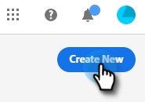
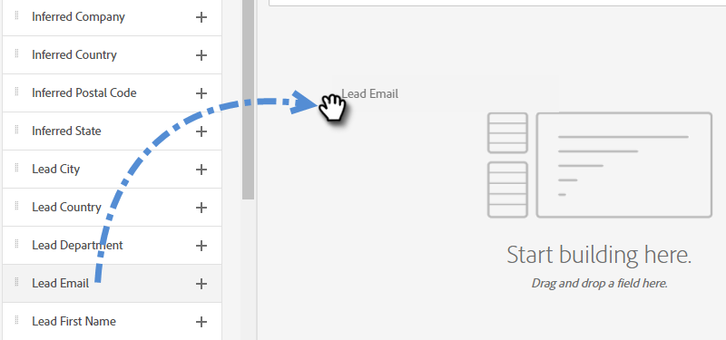
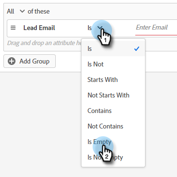

# Dialogrutor {#dialogues}

Dialogrutor är individuella chattsamtal. Lär dig hur du anpassar dem visuellt, avgör vilka sidor de visas på och avgör vad som sägs samt vem som ser dem.

## Skapa en ny dialogruta {#create-a-new-dialogue}

1. Klicka på **Dialogrutor**.

   

1. Klicka på knappen **Skapa ny**.

   

1. Ange ett namn (beskrivningen är valfri), ange prioritetsnivå och klicka på **Spara**.

   

>[!NOTE]
>
>Prioritet avgör vilken dialogruta som visas för en besökare när de kvalificerar sig för flera dialogrutor samtidigt.

## Målgruppskriterier {#audience-criteria}

På samma sätt som med Marketo smarta listor kan du definiera målgruppen med hjälp av attribut för målgruppskriterier. Du kan rikta in dig på kända eller okända personer med hjälp av attribut för härkomst, person eller företag (eller en kombination av dessa).

**Kända personer**

Det finns _många_-attributkombinationer att välja mellan. I det här exemplet riktar vi oss till alla **kända personer** i Kalifornien som arbetar på ett företag med mer än 50 anställda.

1. Ta attributet **Persontillstånd** och dra det åt höger.

   

1. __ Den är inställd som standard. I fältet Välj värden skriver du in CA (du kan också klicka på listrutan och välja från listan).

   

1. Ta attributet **Företagsstorlek** och dra det till den plats där det står _dra och släpp ett attribut här_.

   

   >[!NOTE]
   >
   >Du kan också välja ett attribut genom att klicka på dess **+**-ikon.

1. Klicka på operatorlistrutan och välj **Större än**.

   

1. Skriv 50 och klicka någon annanstans på skärmen för att spara.

   

Och det är allt!

**Anonyma personer**

Det finns ett enkelt sätt att specifikt rikta in sig på personer som inte finns i din databas än. I det här exemplet riktar vi oss till alla **anonyma personer** i New York-området.

1. Hämta attributet **Person Email** och dra det åt höger.

   

1. Klicka på operatorlistrutan och välj **Är tom**.

   

1. Ta attributet **Inced State** och dra det till den plats där det står _dra och släpp ett attribut här_.

   

   >[!NOTE]
   >
   >När någon besöker din webbplats, [Munchkin](/help/marketo/product-docs/administration/additional-integrations/add-munchkin-tracking-code-to-your-website.md) cookies dem och placerar dem i systemet. Vi slår upp deras IP-adresser i en särskild databas och drar nytta av all slags bra information.

1. __ Den är inställd som standard. I fältet Välj värden skriver du NY (du kan också klicka på listrutan och välja från listan).

   

## Lägg till grupper {#add-groups}

Du kan också gruppera attribut om du vill ha alla attribut tillsammans med&quot;all eller något&quot; av andra. Du kan lägga till flera grupper.

## Mål {#target}

Här anger du de URL:er som du vill att en viss dialogruta ska visas på.

Godtagbara format:

* `http://website.com`
* `https://*.website.com`
* `http://website.com/folder/*`
* `https://*.website.com/folder/*`

>[!NOTE]
>
>Om du använder en asterisk fungerar det som ett jokertecken för&quot;catch all&quot;. På så sätt placerar `https://*.website.com` dialogrutan på alla sidor på webbplatsen, inklusive underdomäner (t.ex.: `support.website.com`). Och `https://website.com/folder/*` placerar dialogrutan på varje HTML-sida i efterföljande mapp (t.ex.: Låt oss i det här fallet säga att mappen är &quot;sport&quot;, så: website.com/sports/baseball.html, website.com/sports/football.html osv.).

## Stream Designer {#stream-designer}

Strömdesignern innehåller olika kort som du kan lägga till för att forma chattkonversationen.

<table>
 <tr>
  <td><strong>Meddelande</strong></td>
  <td>Använd när du vill göra en -programsats utan något svar (t.ex.: "Hej! Alla artiklar är 25 % rabatt idag med koden SAVE25").
</td>
 </tr>
 <tr>
  <td><strong>Fråga</strong></td>
  <td>Använd det här alternativet om du vill ställa en flervalsfråga, där du anger tillgängliga svar (t.ex.: Vilken typ av fordon är du intresserad av? Svar = SUV, Compact, Truck osv.).</td>
 </tr>
 <tr>
  <td><strong>Information Capture</strong></td>
  <td>Använd när du vill samla in information. De tre fälten som ska väljas är E-postadress, Telefonnummer och Text (som gör att besökaren kan skriva sitt eget meddelande).</td>
 </tr>
 <tr>
  <td><strong>Schemaläggare för avtalad tid</strong></td>
  <td>Ger besökaren en kalender med tillgängliga datum för att schemalägga en uppföljning. Kalendertillgängligheten återspeglar <a href="/help/marketo/product-docs/demand-generation/dynamic-chat/dynamic-chat-overview.md#routing">nästa agent på rad</a>.</td>
 </tr>
 <tr>
  <td><strong>Mål</strong></td>
  <td>Det här är det enda kortet som besökarna inte ser. Det är upp till dig att avgöra vid vilken punkt ett mål uppnås i den specifika chatten (t.ex.: om du vill samla in besökarens e-postadress placerar du målkortet omedelbart efter Info Capture i strömmen).</td>
 </tr>
</table>

**Skapa en ström**

Det finns _många_ möjliga strömkombinationer. Låt oss titta på ett exempel [i den här artikeln](/help/marketo/product-docs/demand-generation/dynamic-chat/create-a-stream.md).

## Rapporter {#reports}

Visa data från de senaste 90 dagarna på fliken Rapporter. Varje kategori definieras nedan.

<table>
 <tr>
  <td><strong>Totalt utlöst</strong></td>
  <td>Ökningar varje gång en besökare kvalificerar sig för/visas som en dialogruta.
</td>
 </tr>
 <tr>
  <td><strong>Engagerad</strong></td>
  <td>Ökningar varje gång en besökare klickar på chattbot-ankarpunkten för att öppna dialogrutan.</td>
 </tr>
 <tr>
  <td><strong>Slutförd</strong></td>
  <td>Ökningar varje gång en besökare kommer till slutet av en gren i en dialogruta.</td>
 </tr>
 <tr>
  <td><strong>Infångade personer</strong></td>
  <td>Ökningar varje gång en besökare anger en giltig e-postadress i ett dialogflöde.</td>
 </tr>
 <tr>
  <td><strong>Möten bokade</strong></td>
  <td>Ökningar varje gång en besökare kan schemalägga ett möte via chattbot.</td>
 </tr>
 <tr>
  <td><strong>Målen har uppnåtts</strong></td>
  <td>Ökningar varje gång en besökare når ett mål i ett dialogflöde.</td>
 </tr>
</table>

>[!MORELIKETHIS]
>
>[Skapa en ström](/help/marketo/product-docs/demand-generation/dynamic-chat/create-a-stream.md)
