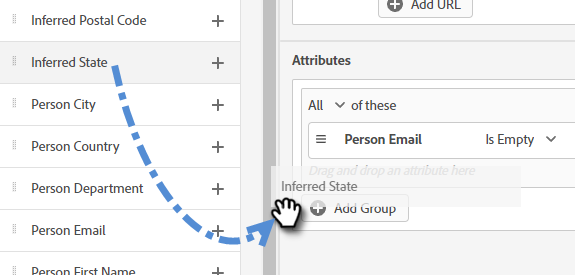

# Målgruppskriterier {#audience-criteria}

På samma sätt som med Marketo smarta listor kan du definiera målgruppen med hjälp av attribut för målgruppskriterier. Du kan rikta in dig på kända eller okända personer med hjälp av attribut för härkomst, person eller företag (eller en kombination av dessa).

## Prioritet {#priority}

Prioritet avgör vilken dialog ett lead får om de kvalificerar sig för mer än en. Det är etablerat när du börjar [skapa en dialogruta](/help/marketo/product-docs/demand-generation/dynamic-chat/dialogues/create-a-dialogue.md){target=&quot;_blank&quot;}. Du kan ändra prioriteten för en befintlig dialogruta genom att öppna den och gå till **Dialogruteinformation** på fliken Målgruppskriterier.

## Händelser {#events}

Med händelser kan ni rikta in er på besökarna baserat på hur mycket de rullar eller hur länge de finns på sidan/webbplatsen. I exemplet nedan riktar vi oss till besökare som har varit på en viss sida i mer än 20 sekunder.

1. Ta tag i **Tid på sidan** och dra den åt höger.

   

1. Ställ in tiden&quot;Större än&quot; på 20 sekunder.

   

1. Lägg till URL-adressen för den önskade sidan i [Mål](#target) -avsnitt.

   

## Attribut {#attributes}

**Kända personer**

Det finns _många_ attributkombinationer att välja mellan. I exemplet nedan riktar vi oss mot alla **kända personer** i Kalifornien som arbetar på ett företag med över 50 anställda.

1. Ta tag i **Persontillstånd** och dra den åt höger.

   

1. _Är_ är inställt som standard. I fältet Välj värden skriver du in CA (du kan också klicka på listrutan och välja från listan).

   

1. Ta tag i **Företagsstorlek** och dra det dit det ska _dra och släpp ett attribut här_.

   

   >[!NOTE]
   >
   >Du kan också välja ett attribut genom att klicka på dess **+** ikon.

1. Klicka på operatorlistrutan och välj **Större än**.

   

1. Skriv 50 och klicka någon annanstans på skärmen för att spara.

   

Och det är allt!

**Anonyma personer**

Det finns ett enkelt sätt att specifikt rikta in sig på personer som inte finns i din databas än. I det här exemplet riktar vi oss mot alla **anonyma personer** i New York.

1. Ta tag i **Personens e-postadress** och dra den åt höger.

   

1. Klicka på operatorlistrutan och välj **Är tom**.

   

1. Ta tag i **Inledningstillstånd** och dra det dit det ska _dra och släpp ett attribut här_.

   

   >[!NOTE]
   >
   >När någon besöker er webbplats [Munchkin](/help/marketo/product-docs/administration/additional-integrations/add-munchkin-tracking-code-to-your-website.md) cookies och placerar dem i systemet. Vi slår upp deras IP-adresser i en särskild databas och drar nytta av all slags bra information.

1. _Är_ är inställt som standard. I fältet Välj värden skriver du NY (du kan också klicka på listrutan och välja från listan).

   

## Lägg till grupper {#add-groups}

Du kan också gruppera attribut om du vill ha alla attribut tillsammans med&quot;all eller något&quot; av andra. Du kan lägga till flera grupper.

## Mål {#target}

Här anger du de URL:er som du vill att en viss dialogruta ska visas på. Du kan också lägga till undantag.

Godtagbara format:

* `http://website.com`
* `https://*.website.com`
* `http://website.com/folder/*`
* `https://*.website.com/folder/*`

>[!NOTE]
>
>Om du använder en asterisk fungerar det som ett jokertecken för&quot;catch all&quot;. Så `https://*.website.com` skulle lägga dialogrutan på alla sidor på webbplatsen, inklusive underdomäner (t.ex.: `support.website.com`). Och `https://website.com/folder/*` placerar dialogrutan på varje HTML-sida i efterföljande mapp (t.ex.: Låt oss i det här fallet säga att mappen är &quot;sport&quot;, så: website.com/sports/baseball.html, website.com/sports/football.html osv.).

**Undantag**

Använd undantag för att säkerställa att dialogrutan gör det **not** visas på en viss sida/ett visst område på webbplatsen. Undantag har samma format som inkluderingar.

>[!MORELIKETHIS]
>
>* [Skapa en dialogruta](/help/marketo/product-docs/demand-generation/dynamic-chat/dialogues/create-a-dialogue.md){target=&quot;_blank&quot;}
>* [Stream Designer](/help/marketo/product-docs/demand-generation/dynamic-chat/dialogues/stream-designer.md){target=&quot;_blank&quot;}
>* [Rapporter](/help/marketo/product-docs/demand-generation/dynamic-chat/dialogues/reports.md){target=&quot;_blank&quot;}

