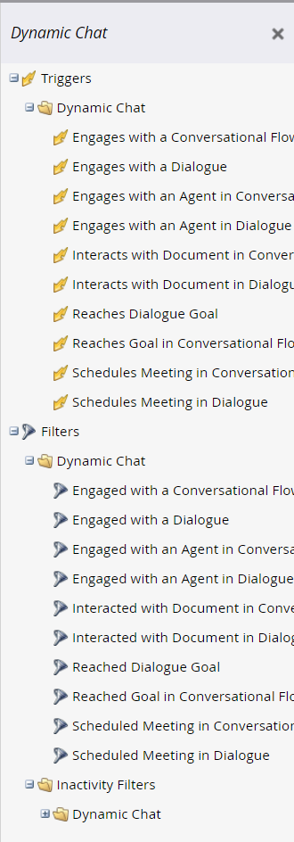

# Dynamic Chat verksamhet {#dynamic-chat-activities}

Dynamic Chat erbjuder flera filter och utlösare som kan användas i dina smarta listor.

## Saker att notera {#things-to-note}

* Villkor stöds i flödessteg i Dynamic Chat
* Dynamic Chat-aktiviteter kan synkroniseras till [Marketo Sales Insight](/help/marketo/product-docs/marketo-sales-insight/msi-for-salesforce/features/dynamic-chat-integration.md){target="_blank"}
* Du kan visa enskilda Dynamic Chat-aktiviteter i aktivitetsloggen för en personpost
