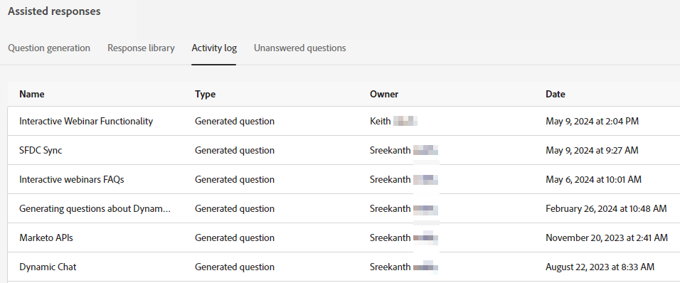

# Aktivitetslogg {#activity-log}

Se en lista över alla uppgifter och deras medföljande information, inklusive namn, ägare, typ och vem som redigerade dem och när.

1. Under Generative AI klickar du på **Assisterade svar**.

   

1. Klicka på **Aktivitetslogg** -fliken.

   

1. Alla aktiviteter för din instans visas på ett ställe.

   
