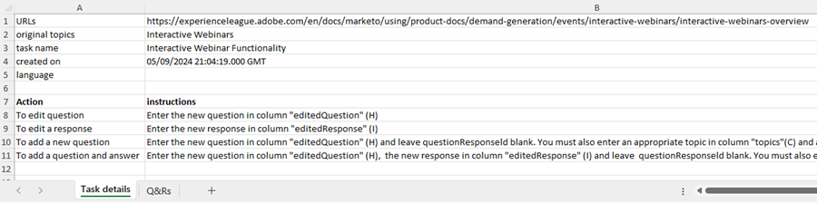

# Fråggenerering {#question-generation}

Se alla dina uppgifter och relevant information, t.ex. när de skapades, det totala antalet frågor, godkännandestatus och mycket annat.

## Generera frågor {#generate-questions}

1. Klicka på **[!UICONTROL Assisted responses]** under Generativ AI.

   

1. Klicka på **[!UICONTROL Generate questions]**.

   

1. Ge aktiviteten ett namn och ange en käll-URL (upp till 10) från vilken allt innehåll extraheras. Ange önskade ämnen/nyckelord och tryck på Retur på tangentbordet. När du är klar klickar du på **[!UICONTROL Generate]**.

   

   >[!IMPORTANT]
   >
   >Om du vill vara säker på att Marketo Engage kan skrapa innehåll från de angivna URL:erna måste du först tillåtslista flera IP-adresser. [Se nedan för mer information](#ip-addresses-to-allowlist).

   >[!NOTE]
   >
   >Webbplatser/sidor måste vara offentliga (dvs. inte dolda bakom en inloggning) för att deras information ska kunna rensas.

1. Beroende på ditt innehåll kan det ta upp till 30 minuter att generera frågor och svar. Klicka på **[!UICONTROL OK]**.

   

   >[!TIP]
   >
   >Klicka på Uppdatera för att se den senaste statusen för din frågegenerering.

   

## Hämta frågor och svar {#download-questions-and-responses}

>[!NOTE]
>
>Genererade frågor och svar kan också visas i [svarsbiblioteket](/help/marketo/product-docs/demand-generation/dynamic-chat/generative-ai/response-library.md).

1. Leta reda på önskad åtgärd och klicka på nedladdningsikonen bredvid namnet.

   

1. Leta reda på hämtningsmappen i webbläsaren och markera filen. Detta kan se annorlunda ut beroende på vilken webbläsare du använder.

   

1. I Excel-filen visar **[!DNL Task details]** bara den informationen om uppgiften, inklusive instruktioner om hur du lägger till/redigerar frågor och/eller svar.

   

   >[!NOTE]
   >
   >Om du bestämmer dig för att lägga till/redigera frågor och/eller svar gruppvis, [lär dig hur du överför dem hit](/help/marketo/product-docs/demand-generation/dynamic-chat/generative-ai/response-library.md).

1. Fliken **[!DNL Q&Rs]** innehåller ytterligare information, inklusive de frågor och svar som genererats.

   

## IP-adresser att Tillåtslista {#ip-addresses-to-allowlist}

Om du vill kunna extrahera innehåll från dina webb-URL:er under genereringen av frågor och svar ska du leta reda på din region nedan och se till att den IP-adress som är associerad med den är tillåtslista av ditt webbteam.

<table width="450">
<thead>
  <tr>
    <th>Nordamerika</th>
    <th>Europa</th>
    <th>APAC</th>
  </tr>
</thead>
<tbody>
  <tr>
    <td>13.68.17.252</td>
    <td>20.105.150.224</td>
    <td>20.213.91.77</td>
  </tr>
</tbody>
</table>
