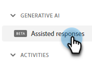
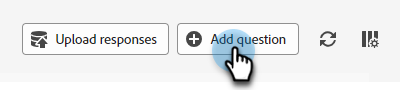
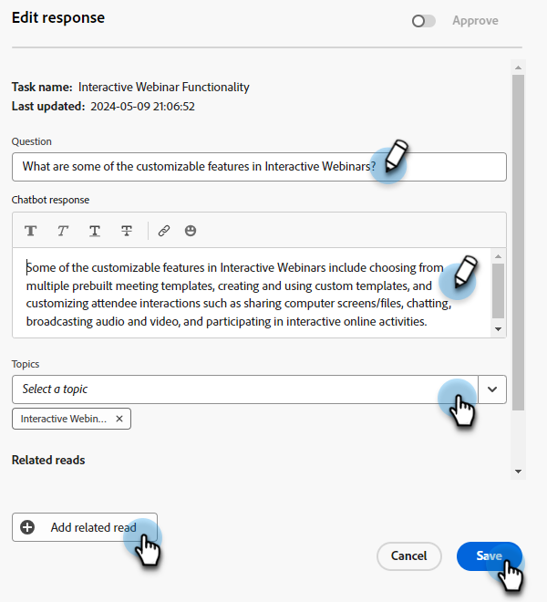

# Svarsbibliotek {#response-library}

På ett och samma ställe visar du alla dina frågor, deras godkännandestatus och aktivitetsnamnet/ämnen som tilldelats dem.

## Lägg till en fråga manuellt {#manually-add-a-question}

1. Klicka på **[!UICONTROL Assisted responses]** under Generativ AI.

   

1. Klicka på fliken **[!UICONTROL Response library]**.

   

1. Klicka på **[!UICONTROL Add question]**.

   

1. Ange fråga och svar. Tilldela ett ämne och lägg till en valfri URL som användare kan dela med besökare. Klicka på **[!UICONTROL Save]** när du är klar.

   

1. Klicka på Uppdatera så visas den nya frågan högst upp med statusen [!UICONTROL Processing].

   

1. Efter några minuter kan du uppdatera igen och statusen ändras till&quot;Godkänd&quot;.

   

## Redigera en enskild fråga/svar {#generate-a-new-question}

>[!NOTE]
>
>Alla genererade frågor och svar tilldelas som standard statusen [!UICONTROL need review]. Endast [!UICONTROL approved] frågor och svar är tillgängliga för chattbesökare.

1. Klicka på önskad fråga i **[!UICONTROL Response library]**.

   

1. Gör dina ändringar och klicka på **[!UICONTROL Save]**.

   

## Redigera och skicka frågor/svar gruppvis {#bulk-edit-and-upload-questions-responses}

Instruktioner om hur du gör massredigeringar i den [hämtade Excel-filen](/help/marketo/product-docs/demand-generation/dynamic-chat/generative-ai/question-generation.md#download-questions-and-responses){target="_blank"} finns nedan. De visas även på fliken Uppgiftsinformation i filen.

<table>
<thead>
  <tr>
    <th>Åtgärd</th>
    <th>Instruktioner</th>
  </tr>
</thead>
<tbody>
  <tr>
    <td>Redigera en fråga</td>
    <td>Ange den nya frågan i kolumnen"editedQuestion" (kolumn H)</td>
  </tr>
  <tr>
    <td>Redigera ett svar</td>
    <td>Ange det nya svaret i kolumnen"editedResponse" (kolumn I)</td>
  </tr>
  <tr>
    <td>Lägg till en ny fråga</td>
    <td>Skriv den nya frågan i kolumnen"editedQuestion" (kolumn H) och lämna questionResponseld tom. Du måste också ange ett lämpligt ämne i kolumnen "topics" (kolumn C) och en käll-URL i kolumnen "sourceUr!"</td>
  </tr>
  <tr>
    <td>Lägg till en fråga och ett svar</td>
    <td>Skriv den nya frågan i kolumnen"editedQuestion" (kolumn H), det nya svaret i kolumnen"editedResponse" (kolumn I) och lämna questionResponse tom. Du måste också ange ett lämpligt ämne i kolumnen "ämnen" (kolumn C)</td>
  </tr>
</tbody>
</table>

1. När du är klar med redigeringarna i filen går du tillbaka till fliken **[!UICONTROL Response library]** och klickar på **[!UICONTROL Upload responses]**.

   

1. Ange det relevanta aktivitetsnamnet. Dra och släpp filen eller bläddra efter den på enheten och markera den. Klicka på **[!UICONTROL Save]** när du är klar.

   

1. Bekräftelsen visas och du är klar.

   

## Filtrera frågor {#filter-your-questions}

Som standard listas frågorna i ordning efter tid/datum då de skapades, och de senaste visas först. Om du letar efter en viss fråga kan du använda filter för att begränsa sökningen. Filtrera efter ämnen, uppgiftsnamn och/eller godkännandestatus.

