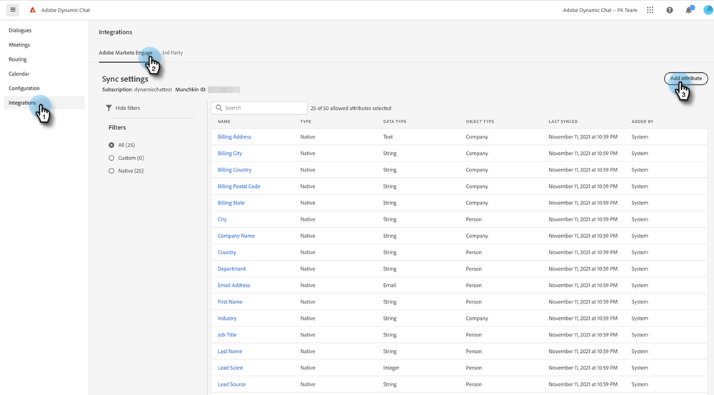

# Adobe Marketo Engage {#adobe-marketo-engage}

## Ansluta Dynamic Chat {#connecting-dynamic-chat}

När du har slutfört den [första konfigurationen](/help/marketo/product-docs/demand-generation/dynamic-chat/setup-and-configuration/initial-setup.md){target="_blank"} är det dags att utföra engångssynkroniseringen som ansluter Dynamic Chat till din Adobe Marketo Engage-prenumeration.

>[!NOTE]
>
>Dynamic Chat har stöd för synkronisering av [Marketo native](https://experienceleague.adobe.com/en/docs/marketo-developer/marketo/rest/lead-database/field-types){target="_blank"} och anpassade personfält och företagsfält.

1. Klicka på panelen **[!UICONTROL Dynamic Chat]** i Min Marketo.

   

   >[!NOTE]
   >
   >Om du inte ser rutan kan du kontakta Marketo Admin.

1. Om du tidigare har använt ett program med en Adobe ID kommer du direkt till Dynamic Chat. Om inte, [konfigurerar du din Adobe ID](https://helpx.adobe.com/manage-account/using/create-update-adobe-id.html){target="_blank"}.

1. Välj **[!UICONTROL Integrations]** om du vill ansluta din Marketo-instans.

   

1. Klicka på **[!UICONTROL Initiate Sync]** på Marketo-kortet.

   

1. Välj upp till 50 attribut (standardfält eller anpassade fält) från din Marketo-instans för att synkronisera med Dynamic Chat för målgruppsanpassning, datamappning och personalisering. Klicka på **[!UICONTROL Next]** när du är klar.

   

1. Granska dina val. Klicka på **[!UICONTROL Confirm]** för att initiera synkroniseringen.

   

>[!NOTE]
>
>Det kan ta mellan 2 och 24 timmar innan synkroniseringen är klar, beroende på databasens storlek.

## Lägg till ett attribut {#add-an-attribute}

Så här lägger du till ytterligare attribut efter den första synkroniseringen.

1. Kontrollera att fliken **[!UICONTROL Integrations]** är markerad i **[!UICONTROL Adobe Marketo Engage]** och klicka på **[!UICONTROL Add Attribute]**.

   

1. Markera de attribut du vill lägga till och klicka på **[!UICONTROL Next]**.

   

1. Granska dina val och klicka på **[!UICONTROL Confirm]**.

   

## Ta bort ett attribut {#remove-an-attribute}

Så här tar du bort ett attribut efter den första synkroniseringen.

>[!NOTE]
>
>Du kan bara se alternativet att ta bort ett attribut om det inte används av några dialogrutor.

1. Kontrollera att fliken **[!UICONTROL Integrations]** är markerad i **[!UICONTROL Adobe Marketo Engage]** och klicka på det attribut du vill ta bort.

   

1. Klicka på **[!UICONTROL Remove Attribute]**.

   

>[!MORELIKETHIS]
>
>[Inledande konfiguration](/help/marketo/product-docs/demand-generation/dynamic-chat/setup-and-configuration/initial-setup.md){target="_blank"}
