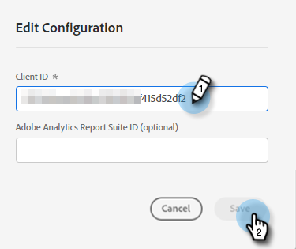

# Adobe PDF Embed API {#adobe-pdf-embed-api}

Med dokumentkortet kan du bädda in PDF-dokument i dialogrutor och spåra besökares engagemangsaktiviteter i dokument. Så här ställer du in det.

1. Navigera till [Adobe PDF Embed API](https://udp.adobe.io/document-services/apis/pdf-embed/){target="_blank"}.

1. Klicka **Hämta autentiseringsuppgifter**.

   

1. Logga in på ditt Adobe-konto.

   

1. Ange dina inloggningsuppgifter, godkänn villkoren och klicka på **Skapa autentiseringsuppgifter**.

   

   >[!IMPORTANT]
   >
   >Du måste använda den domän där du ska vara värd för chattbot (t.ex. om du är värd för chattbot på mycompany.com, se till att du anger det i steg 4).

1. Klicka **Kopiera** för att kopiera ditt klient-ID.

   

1. Tillbaka i Dynamic Chat, klicka **Integreringar**. Klicka på Adobe PDF Embed API-kort **Aktivera**.

   

1. Klistra in ditt klient-ID och klicka på **Spara**.

   

Nu kan du använda dokumentkortet i dina dialogrutor [Stream Designer](/help/marketo/product-docs/demand-generation/dynamic-chat/automated-chat/stream-designer.md){target="_blank"}!

