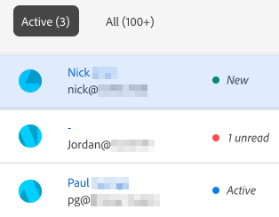
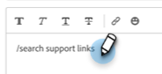

# Agent Inbox {#agent-inbox}

Agenter kan fältgranska chattar direkt i Agent Inbox. Förutom de aktiva konversationerna kan de se tidigare konversationer, besökarinformation och mycket annat.

## Växla tillgänglighet {#availability-toggle}

I det övre högra hörnet av skärmen Agent Inbox kan du ange att din status är tillgänglig eller inte är tillgänglig.

>[!IMPORTANT]
>
>**Detta åsidosätter** den [live-chatttillgänglighet](/help/marketo/product-docs/demand-generation/dynamic-chat/setup-and-configuration/agent-settings.md#live-chat-availability){target="_blank"} som du upprättade i agentinställningarna. Statusen kvarstår tills du antingen byter tillbaka den eller till nästa tidsblock i tillgängligheten.

>[!NOTE]
>
>Inga aktiva chattar påverkas om du anger att din status är otillgänglig.

## Live Chat-meddelanden {#live-chat-notifications}

Läs mer om meddelanden i [Live Chat-översikten](/help/marketo/product-docs/demand-generation/dynamic-chat/live-chat/live-chat-overview.md#live-chat-notifications){target="_blank"}.

## Konversationer {#conversations}

Till vänster på skärmen Agent Inbox kan du välja att bara visa de aktiva konversationerna, eller alla.

>[!NOTE]
>
>Du kan se tidigare (inaktiva) konversationer från dig själv och andra agenter, men du kan bara se dina egna aktiva konversationer.

## Besökarinformation {#visitor-information}

Till höger på skärmen Agent Inbox kan du se (uppifrån och ned) deras namn, befattning, e-postadress, telefonnummer och CRM-status. All information som inte skickas visas som ett bindestreck (-).

## Avsluta en session {#end-a-session}

Agenter kan avsluta en session manuellt genom att klicka på knappen **Avsluta session** bredvid besökarinformationen.

## Kortkommandon {#shortcuts}

>[!NOTE]
>
>Den här funktionen är en del av den generativa AI-funktionen som är tillgänglig via Dynamic Chat Prime-prenumerationen. Kontakta kontoteamet (din kontoansvarige) för mer information.

Kortkommandon, som drivs av det generativa AI-biblioteket [Response](/help/marketo/product-docs/demand-generation/dynamic-chat/generative-ai/response-library.md), är ett bra sätt att få hjälp direkt när du chattar med en besökare. Skriv bara ett snedstreck (`/`) i textrutan och välj `ask` eller `search`.

**Fråga** är om du behöver hjälp med att svara på en fråga.

1. Skriv eller välj `/ask` i textrutan. Skriv din fråga och tryck på Retur på tangentbordet.

   

1. Ett svar visas. Klicka på kopieringsikonen om du vill att den ska klistras in i textrutan. Du kan redigera texten innan du skickar den till besökaren.

   

**Sök** är till för att få hjälp med att hitta sidor som hör till en viss text.

1. Skriv eller välj `/search` i textrutan.

   

1. Skriv vad du vill söka efter och tryck på Retur på tangentbordet.

   

1. Tillämpliga länkar visas. Klicka på kopieringsikonen om du vill att de ska klistras in i textrutan. Du kan redigera innan du skickar informationen till besökaren.

   

## Aktivitetshistorik {#activity-history}

Under besökarinformationen finns aktivitetshistorik. Visa aktivitetstyper och datum och till och med chattutdrag.

>[!NOTE]
>
>Informationen visas endast under de senaste 90 dagarna.

## Kalenderdelning {#calendar-sharing}

Längst ned i chattfönstret finns en ikon som gör att du kan dela din eller en annan agentes kalender med chattbesökaren.

1. Klicka på kalenderikonen.

   

1. Välj önskad agentkalender och klicka på **Skicka**.

   

1. Chattbesökaren kan boka ett möte.

   

## Samtalssammanfattning {#conversation-summary}

>[!NOTE]
>
>Den här funktionen är en del av den generativa AI-funktionen som är tillgänglig via Dynamic Chat Prime-prenumerationen. Kontakta kontoteamet (din kontoansvarige) för mer information.

Samtalssammanfattning genererar en snabb sammanfattning för dig i realtid, inklusive ämnen som besökaren har uttryckt intresse för. Den finns längst ned till höger på alla chattskärmar.

>[!NOTE]
>
>En slutförd konversationssammanfattning finns också i aktivitetsloggen för besökarens personpost i Marketo Engage-databasen.
