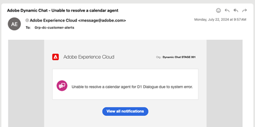

# Möteslista {#meeting-list}

Här ser du alla avtalade tider som har schemalagts av webbplatsbesökare via olika dialogrutor. Här hittar du e-postadressen till personen som bokade den avtalade tiden, vilken agent de bokade den avtalade tiden med, när den avtalade tiden är schemalagd och om den schemalagda mötestiden har gått eller inte.

>[!NOTE]
>
>När ett möte bokas i en agentkalender får agenten ett e-postmeddelande om bokningen, inklusive detaljerad information om besökarens Dynamic Chat-engagemang.

## Misslyckade åtgärdsmeddelanden {#failed-action-notifications}

När en åtgärd som en mötesbokning eller en live-chatt misslyckas meddelas användarna via e-post.

