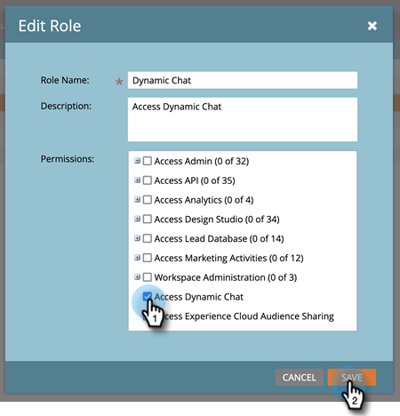

# Lägg till eller ta bort chattanvändare {#add-or-remove-chat-users}

Följ stegen nedan för att lägga till eller ta bort chattanvändare.

## Lägg till en chattanvändare {#add-a-chat-user}

1. Logga in på [Adobe Admin Console](https://adminconsole.adobe.com/){target="_blank"}.

   

1. Klicka på **[!UICONTROL Dynamic Chat]**.

   

   >[!NOTE]
   >
   >Om du har fler än en Marketo-prenumeration väljer du en före nästa steg.

1. Klicka på **[!UICONTROL Users]** -fliken.

   

1. Klicka på **[!UICONTROL Add User]** -knappen.

   

1. Ange namn, användargrupp eller e-postadress för den användare som du vill lägga till. Förnamn och efternamn är valfria.

   

1. Klicka på **+** och välj önskad produktprofil.

   

1. Klicka på **[!UICONTROL Save]**.

   

   >[!NOTE]
   >
   >När du har lagt till en användare i Admin Console i Adobe kan det ta upp till två timmar innan de visas på Dynamic Chat Agent Management-sidan.

## Lägg till Dynamic Chat i Marketo-rollen {#add-dynamic-chat-access-to-marketo-role}

Om den nyligen tillagda chattanvändarens Marketo-roll inte redan har Dynamic Chat-behörighet gör du så här.

1. Klicka på i Marketo **[!UICONTROL Admin]** och markera **[!UICONTROL Users & Roles]**.

   

1. Klicka på **[!UICONTROL Roles]** -fliken.

   

1. Välj den roll du vill ändra i listan och klicka på **[!UICONTROL Edit Role]**.

   

1. Välj **[!UICONTROL Access Dynamic Chat]** och klicka **[!UICONTROL Save]**.

   

## Ta bort en chattanvändare {#remove-a-chat-user}

1. Logga in på [Adobe Admin Console](https://adminconsole.adobe.com/){target="_blank"}.

   

1. Klicka på **[!UICONTROL Dynamic Chat]**.

   

   >[!NOTE]
   >
   >Om du har fler än en Marketo-prenumeration väljer du en före nästa steg.

1. Klicka på **[!UICONTROL Users]** -fliken.

   

1. Markera den användare som du vill ta bort.

   

1. Klicka på **[!UICONTROL Remove User]** -knappen.

   

1. Klicka **[!UICONTROL Remove User]** för att bekräfta.

   

>[!MORELIKETHIS]
>
>* [Adobe Admin Console-användare](https://helpx.adobe.com/enterprise/using/users.html){target="_blank"}
>* [Hantera användare individuellt](https://helpx.adobe.com/enterprise/using/manage-users-individually.html){target="_blank"}
