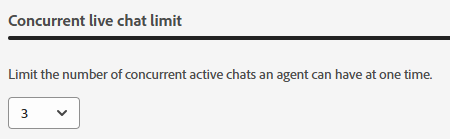
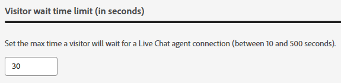

# Agenthantering {#agent-management}

I Agenthantering kan du visa en lista med agenter i din Dynamic Chat-instans, hantera team och ange dina reservregler.

## Agenter {#agents}

På den här fliken visas alla agenter i din Dynamic Chat-instans och den innehåller information om deras namn, e-postadress, status för live-chatt med mera.

{width="800" zoomable="yes"}

>[!NOTE]
>
>Ser du inte en agent som du _just_ har lagt till? Det kan ta upp till två timmar innan de visas här när de har lagts till i Adobe Admin Console.

## Team {#teams}

Administratörer kan skapa team med agenter för att underlätta dirigering till specifika grupper av säljare.

>[!AVAILABILITY]
>
>Åtkomst till team kräver en Dynamic Chat Prime-prenumeration. Kontakta Adobe Account Team (din kontoansvarige) för mer information.

### Skapa ett team {#create-a-team}

1. Klicka på **+ Skapa team**.

   

1. Ge teamet ett namn.

   

1. Klicka på listrutan **Lägg till agenter** och välj önskade agenter.

   

1. Klicka på **Skapa**.

   

## Reservregler {#fallback-rules}

### Mötesreserv {#meeting-fallback}

Välj ett standardmeddelande (systemmeddelande) eller skriv ett anpassat meddelande så att besökarna kan se när mötesbokningen är otillgänglig.

### Live Chatt Fallback {#live-chat-fallback}

Välj ett standardmeddelande (systemmeddelande) eller skriv ett anpassat meddelande så att besökarna kan se när Live-chatten är otillgänglig.

>[!NOTE]
>
>* Om du markerar kryssrutan _Inkludera mötesbokningsalternativ_ får chattbesökaren möjlighet att boka ett möte när inga agenter är tillgängliga för live-chatt.
>
>* **För anpassade regler/team som ett Live-chattkort**: Vid sökning efter agenter, om de inte är tillgängliga eller inte kan ansluta, återgår det till Round Robin för att försöka med &quot;Tillgängliga agenter&quot; (alla som är tillgängliga vid den tidpunkten oavsett vilken routningslogik/regel som placerades i strömmen).

>[!TIP]
>
>När du skapar ett anpassat meddelande kan du formatera teckensnittet, använda länkar och till och med infoga känslolägesikoner! `:)`

## Inställningar {#settings}

### Samtidig chattbegränsning {#concurrent-live-chat}

Ange antalet samtidiga aktiva chattar som en agent kan ta samtidigt. Kan anges mellan 1 och 10.

### Tidsgräns för besökarens väntetid {#visitor-wait-time}

Styr den maximala tiden en besökare väntar (i sekunder) på att bli ansluten till en live-agent innan besökaren får ett reservmeddelande. Kan ställas in mellan 10 och 500 sekunder.

