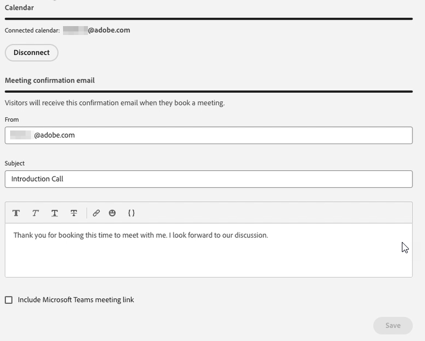

# Agentinställningar {#agent-settings}

Konfigurera din kalender och ange tillgänglighet för möte/live-chatt.

>[!PREREQUISITES]
>
>Kontrollera att dina agenter har beviljats rätt [behörigheter](/help/marketo/product-docs/demand-generation/dynamic-chat/setup-and-configuration/permissions.md){target="_blank"}.

## Anslut kalender {#connect-calendar}

Anslut din Outlook- eller Gmail-kalender på fliken Kalenderkonfiguration för att använda vid schemaläggning av möten i chattbot.

När en användares kalender är ansluten till Dynamic Chat läggs de till i kön och deras kalender blir tillgänglig för webbplatsbesökare att schemalägga avtalade tider på.

>[!NOTE]
>
>Du kan ansluta en kalender per användare. Om du vill få möten i flera kalendrar måste du lägga till flera användare och låta dem ansluta sina kalendrar.

Användare kan också anpassa innehållet i den inbjudan som skickas till besökaren när de schemalägger en avtalad tid i användarens kalender. De kan också markera kryssrutan längst ned för att inkludera en Google Möte- eller Microsoft Teams-länk (beroende på vilken kalender som var ansluten).

>[!TIP]
>
>Använd ikonen för token (klammerparenteser) för att anpassa bekräftelsemeddelanden för mötesbokningar med hjälp av person- eller företagsattribut.

### Behörigheter {#permissions}

När du konfigurerar med Outlook tilldelas Dynamic Chat följande behörigheter:

* Fullständig åtkomst till dina kalendrar
* Logga in dig och läs din profil
* Bevara åtkomst till data som du har gett åtkomst till
* Läs inställningarna för din postlåda

När du konfigurerar med Google tilldelas Dynamic Chat följande behörigheter:

* Skapa, ändra eller ta bort kalendrar
* Uppdatera enskilda kalenderhändelser
* Ändra inställningarna, inklusive vilka som kan se händelserna
* Ändra vem kalendern delas med
* Åtkomst till ditt namn, din e-postadress, språkpreferens och profilbild

## Mötesbokning - tillgänglighet {#meeting-booking-availability}

Ange din tidszon och tid/dag i veckan som du vill ha för att ta emot mötesbokningar.

<table> 
 <tbody> 
  <tr> 
   <td><b>Mötets längd</b></td>
   <td>Anger hur lång tid besökarna ska se i dina tillgängliga mötesplatser.</td>
  </tr> 
  <tr> 
   <td><b>Bufferttid mellan möten</b></td>
   <td>Den tid du anger som buffert efter mötet. Om du anger det i 30 minuter kan ingen boka ett möte med dig förrän 30 minuter efter det schemalagda slutet av ett möte i kalendern.</td>
  </tr>
 </tbody> 
</table>

>[!TIP]
>
>Du kan markera flera tidsblock på samma dag (t.ex. fredag från 8a-12p _och_ 1p-5p) genom att klicka på **+**-tecknet till höger.

## Tillgänglighet för live-chatt {#live-chat-availability}

Ange din tidszon och tid/veckodag som tillgänglig för att ta emot chattar live.

Om du är inloggad på appen får du ett meddelande i appen om en inkommande chatt. Om du inte är inloggad får du ett webbläsarmeddelande (om du har [konfigurerat det ](/help/marketo/product-docs/demand-generation/dynamic-chat/live-chat/agent-inbox.md#live-chat-notifications){target="_blank"}).

>[!IMPORTANT]
>
>* [Tillgänglighetsväxlingen](/help/marketo/product-docs/demand-generation/dynamic-chat/live-chat/agent-inbox.md#availability-toggle){target="_blank"} i agentinkorgen **åsidosätter** vad som anges på fliken _Live-chatttillgänglighet_. Så om agenten är schemalagd som tillgänglig från 1p-5p men behöver ta en snabb paus vid 3p behöver de inte ändra sina agentinställningar. Tillgängligheten växlar status tills den ändras manuellt, tills nästa tidsblock i agentens tillgänglighet nås, eller tills midnatt om agentens angivna tidszon nås (mer information finns i nästa punkt).
>
>* När agenten använder alternativet för tillgänglighet för att ändra sin status till &quot;tillgänglig&quot; återställs deras status automatiskt (växlar till inte tillgänglig) vid midnatt om tidszonen som anges i deras tillgänglighetsschema. Om ingen tidszon anges används UTC (Coordinated Universal Time) som standard.

>[!TIP]
>
>Du kan markera flera tidsblock på samma dag (t.ex. fredag från 8a-12p _och_ 1p-5p) genom att klicka på **+**-tecknet till höger.

## Profilfoto för agent

Även om en agent kan överföra sitt eget profilfoto utförs inte den åtgärden i Dynamic Chat. De måste navigera till `account.adobe.com/profile`. Läs mer här: [Uppdatera din kontoprofil](https://helpx.adobe.com/manage-account/using/edit-adobe-account-personal-profile.html).

>[!NOTE]
>
>Profilbilden som visas i `experience.adobe.com` stöds **inte**.
