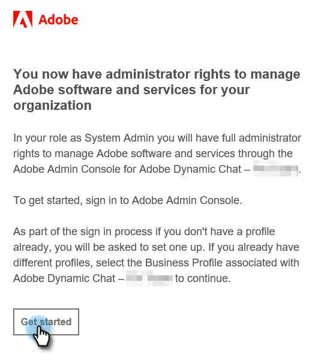

# Inledande konfiguration {#initial-setup}

Konfigurera Dynamic Chat genom att följa stegen nedan.

## Access Admin Console {#access-admin-console}

>[!NOTE]
>
>**Administratörsbehörighet krävs.**

1. När Dynamic Chat har aktiverats för din Marketo-instans får den utsedda systemadministratören ett välkomstmeddelande. I det mejlet klickar du på **Kom igång**.

   

1. Om du tidigare har använt ett program med en Adobe ID kommer du direkt till Adobe Admin Console. Om inte, [konfigurera din Adobe ID](https://helpx.adobe.com/manage-account/using/create-update-adobe-id.html){target="_blank"}.

   

## Lägg till användare {#add-users}

1. När du har loggat in på Admin Console är nästa sak att göra att lägga till användare. Vi har den processen [dokumenteras här](/help/marketo/product-docs/demand-generation/dynamic-chat/setup-and-configuration/add-or-remove-chat-users.md#add-a-chat-user){target="_blank"}.

Nu är det dags att [koppla Dynamic Chat till Marketo](/help/marketo/product-docs/demand-generation/dynamic-chat/integrations/adobe-marketo-engage.md){target="_blank"}.
