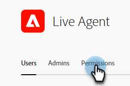
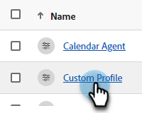

# Behörigheter {#permissions}

Det finns fem standardprofiler med fördefinierade behörigheter som du kan redigera i Dynamic Chat. Du kan också skapa en anpassad profil med en anpassad uppsättning behörigheter. Vi går igenom båda.

## Redigera befintliga behörigheter {#edit-existing-permissions}

1. Klicka på [Dynamic Chat](https://adminconsole.adobe.com/){target="_blank"} i **Adobe Admin Console**.

   

1. Välj den profil som du vill redigera på fliken **Produktprofiler**. I det här exemplet väljer vi **Live Agent**.

   

1. Klicka på fliken **Behörigheter**.

   

1. Markera området i profilen som du vill redigera. I det här exemplet väljer vi Live Chat. Klicka på pennikonen.

   

1. Tillgängliga behörighetsobjekt visas till vänster. Du kan välja att lägga till behörigheter en i taget eller alla på en gång. Klicka på **+**-tecknet.

   

   >[!NOTE]
   >
   >Om du aktiverar Inkludera automatiskt läggs alla behörighetsobjekt till i den inkluderade listan. När nya behörighetsobjekt blir tillgängliga inkluderas de automatiskt för den produktprofilen.

1. Klicka på **Spara**.

   

Nu kan du upprepa den här processen för alla andra Dynamic Chat-områden.

## Skapa en profil {#create-a-profile}

1. Klicka på [Dynamic Chat](https://adminconsole.adobe.com/){target="_blank"} i **Adobe Admin Console**.

   

1. Klicka på **Ny profil** på fliken **Produktprofiler**.

   

1. **Namn** din produktprofil. Du kan också ge den ett visningsnamn och/eller en beskrivning och välja att låta användare få meddelanden när de läggs till/tas bort. Klicka på **Spara** när du är klar.

   

1. Den nya profilen visas på fliken Produktprofiler. Markera den.

   

1. Följ nu steg 3-6 från [avsnittet ovan](#edit-existing-permissions) för varje önskat område.

## Lista över behörigheter {#list-of-permissions}

Här nedan finns en lista med alla tillgängliga behörigheter för varje område.

<table>
<thead>
  <tr>
    <th style="width:25%">Dynamic Chat Area</th>
    <th>Behörigheter</th>
  </tr>
</thead>
<tbody>
  <tr>
    <td>Konversationshantering</td>
    <td><li>Visa dialogrutor</li>
    <li>Hantera dialogrutor (skapa, ta bort)</li>
    <li>Publicera dialogrutor</li>
    <li>Visa konversationsflöden</li>
    <li>Hantera konversationsflöden (skapa, ta bort)</li>
    <li>Publicera konversationsflöden</li></td>
  </tr>
  <tr>
    <td>Live Chatt</td>
    <td><li>Visa mina konversationer</li>
    <li>Visa alla konversationer</li>
  </tr>
  <tr>
    <td>Möten</td>
    <td><li>Hantera alla möten</li>
  </tr>
  <tr>
    <td>Analytics </td>
    <td><li>Visa globala prestandarapporter</li>
    <li>Visa chattrapporter live</li>
    <li>Visa mötesrapporter</li>
    <li>Exportera rapporter</li></td>
  </tr>
  <tr>
    <td>Agentinställningar</td>
    <td><li>Hantera chatttillgänglighet live</li>
    <li>Anslut din kalender</li>
    <li>Hantera kalendertillgänglighet</li></td>
  </tr>
  <tr>
    <td>Administratörsinställningar</td>
    <td><li>Visa Round-robin</li>
    <li>Visa anpassade regler</li>
    <li>Hantera anpassade regler (lägg till, redigera, ta bort)</li>
    <li>Visa kontolista <b>*</b></li>
    <li>Hantera konton (lägg till, redigera, ta bort) <b>*</b></li>
    <li>Hantera Chatbot-inställningar</li>
    <li>Hantera inställningar för konversationsflöden</li>
    <li>Hantera integritet och säkerhet</li>
    <li>Hantera integreringar</li>
    <li>Hantera agenter</li>
    <li>Visa agentteam <b>*</b></li>
    <li>Hantera agentteam (lägg till, redigera, ta bort) <b>*</b></li></td>
  </tr>
</tbody>
</table>

**&#42;** är för närvarande endast tillgängligt för användare av Dynamic Prime

## Standardprofilbehörigheter {#default-profile-permissions}

Nedan visas de fem standardprofilerna och de behörigheter som är aktiverade som standard.

<table>
<thead>
  <tr>
    <th style="width:25%">Profil</th>
    <th>Standardbehörigheter</th>
  </tr>
</thead>
<tbody>
  <tr>
    <td>Marknadsförare</td>
    <td><i>Konversationshantering</i>
    <li>Visa dialogrutor</li>
    <li>Hantera dialogrutor (skapa, ta bort)</li>
    <li>Publicera dialogrutor</li>
    <li>Visa konversationsflöden</li>
    <li>Hantera konversationsflöden (skapa, ta bort)</li>
    <li>Publicera konversationsflöden</li>
     
    <i> Live-chatt </i>
    <li>n/a</li>
     
    <i>Möten</i>
    <li>n/a</li>
     
    <i> Analyser </i>
    <li>Visa globala prestandarapporter</li>
    <li>Visa chattrapporter live</li>
    <li>Visa mötesrapporter</li>
     
    <i> Agentinställningar </i>
    <li>n/a</li>
     
    <i> Administratörsinställningar </i>
    <li>Visa Round-robin</li>
    <li>Visa anpassade regler</li>
    <li>Visa kontolista <b>*</b></li>
    <li>Visa agentteam <b>*</b></li>
    </td>
  </tr>
  <tr>
    <td><b>Live Agent</b></td>
    <td><i>Konversationshantering</i>
    <li>Visa dialogrutor</li>
    <li>Visa konversationsflöden</li>
     
    <i> Live-chatt </i>
    <li>Visa mina konversationer</li>
     
    <i>Möten</i>
    <li>n/a</li>
     
    <i> Analyser </i>
    <li>Visa globala prestandarapporter</li>
    <li>Visa chattrapporter live</li>
    <li>Visa mötesrapporter</li>
     
    <i> Agentinställningar </i>
    <li>Hantera chatttillgänglighet live</li>
    <li>Anslut din kalender</li>
    <li>Hantera kalendertillgänglighet</li>
     
    <i> Administratörsinställningar </i>
    <li>Visa Round-robin</li>
    <li>Visa anpassade regler</li>
    <li>Visa kontolista <b>*</b></li>
    <li>Visa agentteam <b>*</b></li>
    </td>
  </tr>
  <tr>
    <td><b>Kalenderagent</b></td>
    <td><i>Konversationshantering</i>
    <li>Visa dialogrutor</li>
    <li>Visa konversationsflöden</li>
     
    <i> Live-chatt </i>
    <li>n/a</li>
     
    <i>Möten</i>
    <li>n/a</li>
     
    <i> Analyser </i>
    <li>Visa globala prestandarapporter</li>
    <li>Visa chattrapporter live</li>
    <li>Visa mötesrapporter</li>
     
    <i> Agentinställningar </i>
    <li>Anslut din kalender</li>
    <li>Hantera kalendertillgänglighet</li>
     
    <i> Administratörsinställningar </i>
    <li>Visa Round-robin</li>
    <li>Visa anpassade regler</li>
    <li>Visa kontolista <b>*</b></li>
    <li>Visa agentteam <b>*</b></li>
    </td>
  </tr>
  <tr>
    <td><b>Marknadsföringsadministratör</b></td>
    <td><i>Konversationshantering</i>
    <li>Visa dialogrutor</li>
    <li>Hantera dialogrutor (skapa, ta bort)</li>
    <li>Publicera dialogrutor</li>
    <li>Visa konversationsflöden</li>
    <li>Hantera konversationsflöden (skapa, ta bort)</li>
    <li>Publicera konversationsflöden</li>
     
    <i> Live-chatt </i>
    <li>n/a</li>
     
    <i>Möten</i>
    <li>n/a</li>
     
    <i> Analyser </i>
    <li>Visa globala prestandarapporter</li>
    <li>Visa chattrapporter live</li>
    <li>Visa mötesrapporter</li>
    <li>Exportera rapporter</li>
     
    <i> Agentinställningar </i>
    <li>n/a</li>
     
    <i> Administratörsinställningar </i>
    <li>Visa Round-robin</li>
    <li>Visa anpassade regler</li>
    <li>Hantera anpassade regler (lägg till, redigera, ta bort)</li>
    <li>Visa kontolista <b>*</b></li>
    <li>Hantera konton (lägg till, redigera, ta bort) <b>*</b></li>
    <li>Hantera Chatbot-inställningar</li>
    <li>Hantera inställningar för konversationsflöden</li>
    <li>Hantera integritet och säkerhet</li>
    <li>Hantera integreringar</li>
    <li>Visa agentteam <b>*</b></li>
    </td>
  </tr>
  <tr>
    <td><b>Försäljningsadministratör</b></td>
    <td><i>Konversationshantering</i>
    <li>Visa dialogrutor</li>
    <li>Visa konversationsflöden</li>
     
    <i> Live-chatt </i>
    <li>Visa mina konversationer</li>
    <li>Visa alla konversationer</li>
     
    <i>Möten</i>
    <li>Hantera alla möten</li>
     
    <i> Analyser </i>
    <li>Visa globala prestandarapporter</li>
    <li>Visa chattrapporter live</li>
    <li>Visa mötesrapporter</li>
    <li>Exportera rapporter</li>
     
    <i> Agentinställningar </i>
    <li>Hantera chatttillgänglighet live</li>
    <li>Anslut din kalender</li>
    <li>Hantera kalendertillgänglighet</li>
     
    <i> Administratörsinställningar </i>
    <li>Visa Round-robin</li>
    <li>Visa anpassade regler</li>
    <li>Hantera anpassade regler (lägg till, redigera, ta bort)</li>
    <li>Visa kontolista <b>*</b></li>
    <li>Hantera konton (lägg till, redigera, ta bort) <b>*</b></li>
    <li>Hantera agenter</li>
    <li>Visa agentteam <b>*</b></li>
    <li>Hantera agentteam <b>*</b></li>
    </td>
  </tr>
</tbody>
</table>

**&#42;** är för närvarande endast tillgängligt för användare av Dynamic Prime
