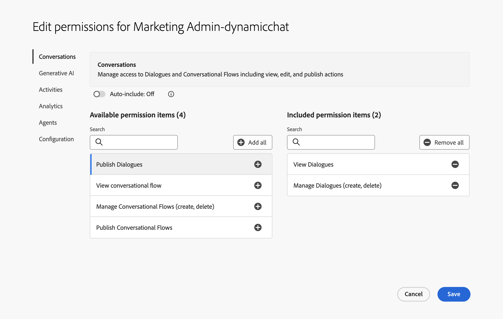

# Behörigheter {#permissions}

Hantera användaråtkomst till de olika områdena i Dynamic Chat.

1. I [Adobe Admin Console](https://adminconsole.adobe.com/){target="_blank"}, klicka **Dynamic Chat**.

   

1. I **Produktprofiler** markerar du den profil som du vill redigera. I det här exemplet väljer vi **Live Agent**.

   

1. Klicka på **Behörigheter** -fliken.

   

1. Markera det område i Dynamic Chat som du vill redigera. Eftersom vi har valt Live Agent-profilen väljer vi Live Chat. Klicka på pennikonen.

   

1. Alla tillgängliga behörighetsobjekt finns till vänster. Du kan välja att lägga till behörigheter en i taget eller alla på en gång. I det här exemplet väljer vi alla. Klicka på **+ Lägg till alla** -knappen.

   

   >[!NOTE]
   >
   >Om du aktiverar Inkludera automatiskt läggs alla behörighetsobjekt till i den inkluderade listan. När nya behörighetsobjekt blir tillgängliga inkluderas de automatiskt för den produktprofilen.

1. Klicka **Spara**.

   

Nu kan du upprepa den här processen för alla andra Dynamic Chat-områden.

## Lista över behörigheter {#list-of-permissions}

Här nedan hittar du en lista över alla tillgängliga behörigheter sorterade efter område.

<table>
<thead>
  <tr>
    <th>Dynamic Chat</th>
    <th>Behörigheter</th>
  </tr>
</thead>
<tbody>
  <tr>
    <td>Konversationshantering</td>
    <td><li>Visa dialogrutor</li>
    <li>Hantera dialogrutor (skapa, ta bort)</li>
    <li>Publicera dialogrutor</li>
    <li>Visa konversationsflöden</li>
    <li>Hantera konversationsflöden (skapa, ta bort)</li>
    <li>Publicera konversationsflöden</li></td>
  </tr>
  <tr>
    <td>Live Chatt</td>
    <td><li>Agent Inbox</li>
    <li>Visa mina konversationer</li>
    <li>Visa alla konversationer</li>
    <li>Visa konversationssammanfattning<b>*</b></li>
    <li>Visa assisterade svar<b>*</b></li></td>
  </tr>
  <tr>
    <td>Möten</td>
    <td><li>Hantera alla möten</li>
    <li>Hantera mina möten</li></td>
  </tr>
  <tr>
    <td>Analyser</td>
    <td><li>Visa globala prestandarapporter</li>
    <li>Visa chattrapporter live</li>
    <li>Visa mötesrapporter</li>
    <li>Exportera rapporter</li></td>
  </tr>
  <tr>
    <td>Agentinställningar</td>
    <td><li>Hantera chatttillgänglighet live</li>
    <li>Anslut din kalender</li>
    <li>Hantera kalendertillgänglighet</li></td>
  </tr>
  <tr>
    <td>Administratörsinställningar</td>
    <td><li>Visa arbetsytor<b>*</b></li>
    <li>Hantera arbetsytor (skapa, redigera, ta bort)<b>*</b></li>
    <li>Visa Round-robin</li>
    <li>Visa anpassade regler</li>
    <li>Hantera anpassade regler (lägg till, redigera, ta bort)</li>
    <li>Visa kontolista<b>*</b></li>
    <li>Hantera konton (lägg till, redigera, ta bort)<b>*</b></li>
    <li>Hantera Chatbot-inställningar</li>
    <li>Hantera inställningar för konversationsflöden</li>
    <li>Hantera integritet och säkerhet</li>
    <li>Hantera integreringar</li>
    <li>Hantera språk<b>*</b></li>
    <li>Hantera agenter</li>
    <li>Visa agentteam<b>*</b></li>
    <li>Hantera agentteam (lägg till, redigera, ta bort)<b>*</b></li>
    <li>Visa användningsgränser</li></td>
  </tr>
</tbody>
</table>

**&#42;** Endast tillgängligt för Dynamic Prime-användare
