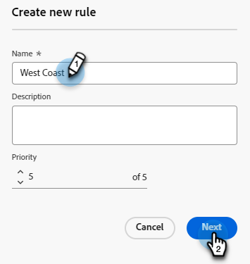

# Routning {#routing}

Möten som bokats i Dynamic Chat kan dirigeras på två sätt. Rundar av eller använder en anpassad regel.

Runda av: Möten tilldelas agenter sekventiellt. Så om du har fem agenter och agent tre tog det senaste mötet, så får agent fyra nästa, följt av agent fem, sen till agent ett.

Anpassad regel: Du kan välja särskilda agenter för att få möten baserat på de attribut du väljer.

>[!NOTE]
>
>Kontodirigering har högsta prioritet. När en besökare når punkten i konversationen för att antingen boka ett möte eller initiera en live-chatt, kontrolleras [Kontoroutning](#account-routing) först innan andra routningsalternativ övervägs.

## Skapa en anpassad regel {#create-a-custom-rule}

I det här exemplet skickar vi alla möten från de härledda delstaterna CA, OR och WA till agent John.

1. Klicka på **Routningsregler** under Konfiguration.

   

1. Klicka på fliken **Anpassade regler**.

   

1. Klicka på **Skapa regel**.

   

1. Ge din regel ett namn. Du kan också lägga till en beskrivning och ange dess prioritetsnivå. Klicka på **Nästa**.

   

1. Välj önskad(a) agent(er).

   

1. Dra över önskade attribut.

   

1. Sök efter och välj önskade värden.

   

1. När alla dina önskade värden är markerade klickar du på **Spara**.

   

## Kontodirigering {#account-routing}

Identifiera och överför ditt målkonto och respektive säljare och skicka besökare som kommer från dessa konton direkt till respektive kontoägare.

### Lägg till ett konto {#add-an-account}

I det här exemplet dirigerar vi alla anställda från Lego direkt till agent Steven.

1. Klicka på **+ Lägg till konto** på fliken Kontoroutning.

   

   >[!TIP]
   >
   >Du kan skapa flera konton samtidigt genom att klicka på **Överför kontolista** och överföra en CSV-fil.

1. Ange företagets namn, domän och välj önskad agent.

   
