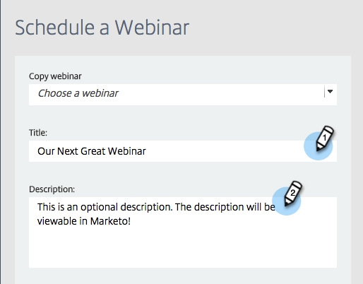

# Skapa en händelse med GotoWebinar {#create-an-event-with-gotowebinar}

>[!PREREQUISITES]
>
>* [Lägg till GoToWebinar som en LaunchPoint-tjänst](/help/marketo/product-docs/administration/additional-integrations/add-gotowebinar-as-a-launchpoint-service.md)
>* [Skapa ett nytt händelseprogram](/help/marketo/product-docs/demand-generation/events/understanding-events/create-a-new-event-program.md)
>* Ange lämpliga [flödesåtgärder](/help/marketo/product-docs/core-marketo-concepts/smart-campaigns/flow-actions/add-a-flow-step-to-a-smart-campaign.md)för att spåra engagemang

Skapa först ditt webbinarium i GoToWebinar. Vissa inställningar när du skapar GoToWebinar används av Marketo och vissa används bara av GoToWebinar.

När du har skapat en Marketo-händelse och associerat GoToWebinar med den kan systemen dela registrerings- och närvaroinformation.

Nedan finns en lista med de inställningar som används av Marketo.

## Titel och beskrivning {#title-and-description}

**Namn**  på webbinarium- ange namnet på webbinariet. Det här namnet kan visas i Marketo.

**Beskrivning**  (valfritt) - ange beskrivningen för webbinariet. Beskrivningen kan`visas i Marketo.

## Datum och tid {#date-time}

Ange följande information för ditt webbinarium så hämtas det till Marketo via adaptern. Om du ändrar något i den här informationen måste du klicka på länken **Uppdatera från webbinariet Provider** under **Händelseåtgärder** för att Marketo ska kunna se ändringarna.

**Startdatum** - ange startdatum. Den här visas i Marketo.

**Starttid**  - ange starttid. Den här visas i Marketo.

**Sluttid** - ange sluttid. Den här visas i Marketo.

**Tidszon** - välj önskad tidszon. Den kommer att kunna ses i Marketo.

**Skriv -** inställt på  **en session**.

>[!NOTE]
>
>Marketo stöder för närvarande inte återkommande webbinarier. Du måste skapa en enda session mellan varje Marketo Event- och GoToWebinar-webbinarium.

>[!TIP]
>
>Om du behöver ytterligare hjälp med GoToWebinar går du till deras [hjälpwebbplats](https://support.logmeininc.com/gotowebinar).

Nu går vi till Marketo!

1. Välj en händelse. Klicka på **Händelseåtgärder** och välj **Händelseinställningar**.

   

   >[!NOTE]
   >
   >Kanaltypen för den valda händelsen måste vara **webbinarium**.

1. Välj **GoToWebinar** i listan **Event Partner**.

   

1. Välj konto.

   

1. Välj webbinariet.

   

1. Klicka på **Spara**.

   

1. Underbar! Händelsen synkroniseras och schemaläggs av **GoToWebinar**.

   

   >[!NOTE]
   >
   >Fälten som Marketo skickar är: Förnamn, efternamn, e-postadress. Dessa fält är obligatoriska och får inte vara tomma.

   >[!TIP]
   >
   >Om du vill fylla i bekräftelsemeddelandet med den här unika URL-adressen använder du följande token i e-postmeddelandet: `{{member.webinar url}}`. När bekräftelse-URL:en skickas, tolkas denna token automatiskt till personens unika bekräftelse-URL.
   >
   >Ange din bekräftelse via e-post till **Operational** för att säkerställa att personer som registrerar sig och kan avbeställa prenumerationen fortfarande får sin bekräftelseinformation.

   

   >[!CAUTION]
   >
   >Undvik att använda kapslade e-postprogram för att skicka ut bekräftelsemeddelanden. Använd händelseprogrammets smarta kampanj i stället, som visas ovan.

   >[!TIP]
   >
   >Det kan ta upp till 48 timmar innan data visas i Marketo. Om du fortfarande inte ser något efter att ha väntat så länge väljer du **Uppdatera från webbinariet Provider** på menyn Händelseåtgärder på fliken **Sammanfattning** för din händelse.

Personer som registrerar sig för ditt webbinarium kommer att pushas till din webbinarileverantör via flödessteget Ändra programstatus när Ny status är inställd på&quot;Registrerad&quot;. Ingen annan status kommer att föra personen över. Se även till att du följer flödessteget Ändra programstatus 1 och Skicka e-postflöde 2.

## Visa schemat {#viewing-the-schedule}

Klicka på kalenderposten för aktiviteten i programschemavyn. Schemat visas till höger på skärmen.

>[!NOTE]
>
>Om du vill ändra ditt evenemangsschema måste du redigera webbinariet på GoToWebinar.

