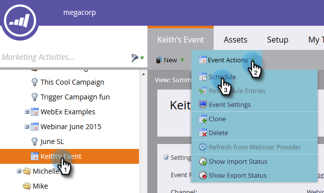

# Konfigurera händelseinställningar och synkronisera Marketo med ditt webbinarium {#configure-event-settings-and-sync-marketo-with-your-webinar}

Följ de här stegen för att konfigurera händelseinställningarna för Marketo och ansluta Marketo och ON24.

## Ange händelsen {#set-the-event}

1. Välj den händelse som du vill associera med ett ON24-webbinarium, klicka sedan på listrutan **[!UICONTROL Event Actions]** och välj **[!UICONTROL Event Settings]**.

   

1. Välj ON24 som [!UICONTROL Event Partner].

   

1. Välj kontot [!UICONTROL Login] (till exempel visningsnamnet).

   

1. Ange [!UICONTROL Event Id] (hämta den från ON24). Klicka på **[!UICONTROL Save]**.

   

   >[!NOTE]
   >
   >Under högbelastningstider kan det ta 15 till 20 minuter för ON24 att göra händelseinformationen tillgänglig för Marketo. Om du får meddelandet&quot;Ogiltigt sessions-ID&quot; kan du försöka igen lite senare.

## Ange schema {#set-the-schedule}

När du ställer in en händelse som är associerad med ett ON24-webbinarium fylls händelseschemat i med data från ON24. Följ de här stegen för att komma åt dialogrutan [!UICONTROL Event Schedule].

1. Markera händelsen. Klicka på listrutan **[!UICONTROL Event Actions]** och välj **[!UICONTROL Schedule].**

   

1. Välj **[!UICONTROL Start Date]**, **[!UICONTROL End Date]** och **[!UICONTROL Time Zone]**. Klicka på **[!UICONTROL Save]**.

   

   >[!NOTE]
   >
   >Om du uppdaterar någon händelseinformation i ON24 måste du klicka på **[!UICONTROL Refresh from Webinar Provider]** på [!UICONTROL Event Actions]-menyn för att se hur nya data fylls i.

Nu kan du gå vidare till nästa steg: [skapa underordnade kampanjer och lokala resurser](/help/marketo/product-docs/demand-generation/events/create-an-event/create-an-event-with-the-marketo-on24-adapter/create-child-campaigns-and-local-assets.md){target="_blank"}.

>[!MORELIKETHIS]
>
>[Om Marketo On24-nätverkskortshändelser](/help/marketo/product-docs/demand-generation/events/create-an-event/create-an-event-with-the-marketo-on24-adapter/understanding-marketo-on24-adapter-events.md){target="_blank"}
