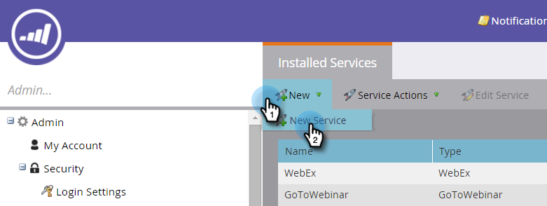

# Ange dina ON24-autentiseringsuppgifter i Marketo {#enter-your-on-credentials-in-marketo}

Låt oss komma igång med din ON24-händelseintegrering. Om du någon gång behöver redigera eller ta bort dina inloggningsuppgifter, beskrivs dessa steg också nedan.

## Ange autentiseringsuppgifter {#enter-credentials}

1. Logga in på Marketo och klicka på **Admin**.

   

1. Klicka på **LaunchPoint** i Integrering.

   

1. Under Installerade tjänster klickar du på **Ny** och sedan på **Ny tjänst**.

   

1. Ange följande information i dialogrutan Ny tjänst:

   * **Visningsnamn**  - Ange ett namn som ska användas i Marketo. Detta kan vara ditt namn eller namnet på din grupp om du delar inloggningsuppgifter.
   * **Service**  - Välj  **On24** i listrutan.

   * **Klientnyckel**  - Ange den ON24-klientnyckel som du använder för inloggning. Klientnyckeln är en 32-siffrig sträng som innehåller en blandning av bokstäver och siffror.
   * **Klient-ID**  - Ange det 4-siffriga ON24-klient-ID som du använder för inloggning. Du kan hämta klient-ID:t och klientnyckeln direkt från kontohanteraren för ON24.

   

1. Klicka på **Skapa**.

   

1. När autentiseringsuppgifterna har validerats läggs de till på sidan Installerade tjänster. Om ett fel uppstår kan du inte spara autentiseringsuppgifterna.

## Redigera autentiseringsuppgifter {#edit-credentials}

Du kan redigera dina autentiseringsuppgifter om ditt lösenord upphör att gälla eller om du behöver ändra en befintlig autentiseringsuppgift.

1. På fliken Installerade tjänster väljer du de autentiseringsuppgifter som du vill redigera och klickar på **Redigera tjänst**.

   

1. Uppdatera informationen i dialogrutan Redigera tjänst och klicka på **Spara**.

   

## Ta bort en tjänst {#delete-a-service}

1. På fliken Installerade tjänster väljer du den tjänst du vill ta bort, klickar på listrutan **Tjänståtgärder** och väljer **Ta bort tjänst**.

   

1. Klicka på **Ta bort**.

   

Nästa steg är att [skapa webbinariet i ON24](create-your-webinar-event-in-on24.md).

>[!MORELIKETHIS]
>
>* [Om Marketo ON24-adapterhändelser](understanding-marketo-on24-adapter-events.md)

>

