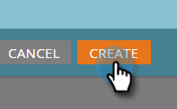

# Exempel på händelseintegrering ON24 {#example-on-event-integration}

Här är ett exempel på en händelse, inklusive kampanjer, för ett ON24-webbinarium. När du skapar en händelse måste du testa kampanjerna innan du kör dem.

## Skapa en ny händelse i marknadsföringsaktiviteter {#create-a-new-event-in-marketing-activities}

1. Välj **Nytt** > **Nytt program**.

   

1. Välj en **kampanjmapp** där händelsen ska finnas.

   

1. Ange ett **namn** för händelsen.

   

1. Välj **Event **som **programtyp**.

   

1. Välj **Webinar **som **Channel **för händelsen.

   

1. Klicka på **Skapa**.

   

## Bjud in (gruppkampanj)  {#invite-batch-campaign}

* **Smart List** - Definiera vem du ska bjuda in till händelsen.
* **Flöde**

   * Skicka e-post - Om det här är en lokal resurspost får den följande namnkonvention: EventName.EmailName. Du kan också använda globala e-postmeddelanden.
   * Ändra status i progression - Ange som webbinarium > Inbjuden.

* **Schema** - Ange datumet för den inbjudan som ska skickas.

## Registrering/bekräftelse (utlösarkampanj) {#registration-confirmation-trigger-campaign}

* **Smart List**

   * Starta kampanjen baserat på **ifyllningsformulär**. Se till att du inkluderar den landningssida som formuläret finns på med **Lägg till begränsning**, särskilt om formuläret används på flera landningssidor.

>[!CAUTION]
>
>Du måste använda ett Marketo-formulär för att registrera personer för händelsen, eller ett icke-Marketo-formulär med rätt API-integrering för att skicka registreringsdata till Marketo. Detta är viktigt för att integreringen av din Event Partner ska lyckas. **OBS**: Om du använder ett Marketo-formulär på en icke-Marketo-landningssida kommer utlösaren att vara **Fyll i formulär** med formulärnamnet.

* **Flöde**

   * **Ändra status i progression** - Ange som webbinarium > Registrerad. **VARNING**: Det här flödessteget krävs när du konfigurerar din underordnade kampanj. När en persons status ändras till **Registrerad**, skickar Marketo registreringsinformationen till ON24.

   * **Skicka e-post** - bekräftelsemeddelande ( **använd** så att de som har registrerat sig fortfarande får det).

**OBS**: Om personen returneras med ett registreringsfel får han/hon inte någon e-postbekräftelse.

## Påminnelse (gruppkampanj) {#reminder-batch-campaign}

* **Smart List** - Filtrera med **Medlem i program** och ange status till **Registrerad**.

* **Flöde** - Skicka e-post (påminnelse-e-post).

**OBS**: Du kan använda en liknande kampanj för att skicka ett *annat* uppföljningsmeddelande till personer som har bjudits in men som inte har registrerat sig än.

## Uppföljningskampanj (batch- eller utlösarkampanj) {#follow-up-campaign-batch-or-trigger-campaign}

* **Smart List** - utlösare baserad på förändringar i programstatus.

* **Flöde** - Skicka e-post. Använd alternativ för att skicka olika e-postmeddelanden baserat på programstatus.

>[!MORELIKETHIS]
>
>* [Om Marketo ON24-adapterhändelser](understanding-marketo-on24-adapter-events.md)

>

