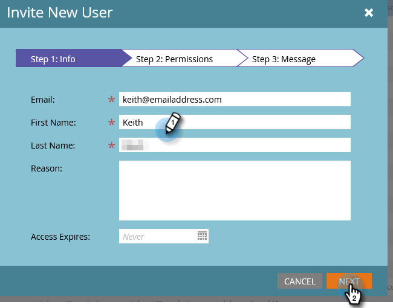

# Konfigurera ON24-integreringen med Marketo{#set-up-the-on24-integration-with-marketo}

Så här konfigurerar du din ON24-händelseintegrering.

## Skapa en roll enbart för API {#create-an-api-only-role}

1. I My Marketo klickar du på **Administratör**.

   

1. Klicka på under Dokumentskydd **Användare och roller**.

   

1. Klicka på **Roller** och sedan **Ny roll**.

   

1. Ange ett rollnamn. Öppna **Åtkomst-API** och välj&quot;Read-Write Custom Object&quot; och&quot;Read-Write Person&quot;. Klicka **Skapa**.

   

## Skapa en ny användare {#create-a-new-user}

1. Klicka på knappen **Användare** och klicka **Bjud in ny användare**.

   

1. Ange den nya användarens information och klicka på **Nästa**.

   

1. Välj den roll för endast ON24 API som du nyss skapade. Välj **Endast API** kryssrutan. Klicka **Nästa**.

   

1. Klicka **Skicka**.

   

>[!NOTE]
>
>Ingen inbjudan krävs för användare med endast API.

## Konfigurera ON24-anslutning {#set-up-on24-connection}

1. Klicka fortfarande i administratörsavsnittet på **LaunchPoint**.

   

1. Klicka **Nytt** sedan **Ny tjänst**.

   

1. Välj ett visningsnamn. Klicka på **Tjänst** nedrullningsbar meny och välj **Egen**. Ange en beskrivning. Klicka på listrutan Endast API-användare och välj den användare som du skapade [i stegen ovan](#create-a-new-user). Klicka **Skapa**.

   

1. Hitta den anpassade LaunchPoint-tjänst som du just skapade och klicka på Visa detaljer.

   

1. Markera, högerklicka, kopiera och spara klient-ID:t (du behöver det senare). Upprepa för Klienthemlighet.

   

1. Klicka på Webbtjänster i trädet till vänster.

   

1. Under REST API markerar du, högerklickar, kopierar och sparar den första delen av Identity (fram till &#39;m&#39; på .com).

   

1. Navigera med ditt sparade klient-ID, klienthemlighet och identitet till ditt ON24-konto. Resten av stegen utförs där och är [anges här](https://on24support.force.com/Support/s/article/Connect-Marketo-ON24-Connect-Data-Integration#Step6){target="_blank"}.
