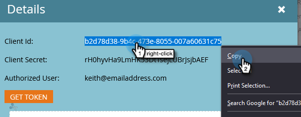

# Konfigurera ON24-integreringen med Marketo{#set-up-the-on24-integration-with-marketo}

Så här konfigurerar du din ON24-händelseintegrering.

## Skapa en roll enbart för API {#create-an-api-only-role}

1. Klicka på **[!UICONTROL Admin]** i Min Marketo.

   

1. Klicka på [!UICONTROL Security] under **[!UICONTROL Users & Roles]**.

   

1. Klicka på fliken **[!UICONTROL Roles]** och sedan på **[!UICONTROL New Role]**.

   

1. Ange [!UICONTROL Role Name]. Öppna menyn **[!UICONTROL Access API]** och välj [!UICONTROL Read-Write Custom Object] och [!UICONTROL Read-Write Person]. Klicka på **[!UICONTROL Create]**.

   

## Skapa en ny användare {#create-a-new-user}

1. Klicka på fliken [!UICONTROL Users & Roles] i **[!UICONTROL Users]** och klicka sedan på **[!UICONTROL Invite New User]**.

   

1. Ange den nya användarens information och klicka på **[!UICONTROL Next]**.

   

1. Markera [!UICONTROL ON24 API Only Role (all workspaces)] som du nyss skapade. Markera kryssrutan **[!UICONTROL API Only]**. Klicka på **[!UICONTROL Next]**.

   

1. Klicka på **[!UICONTROL Send]**.

   

>[!NOTE]
>
>Ingen inbjudan krävs för användare med endast API.

## Konfigurera ON24-anslutning {#set-up-on24-connection}

1. Klicka på [!UICONTROL Admin] i avsnittet **[!UICONTROL LaunchPoint]**.

   

1. Klicka på **[!UICONTROL New]** och sedan på **[!UICONTROL New Service]**.

   

1. Välj en [!UICONTROL display name]. Klicka på listrutan **[!UICONTROL Service]** och välj **[!UICONTROL Custom]**. Ange [!UICONTROL description]. Klicka på listrutan [!UICONTROL API Only User] och välj den användare du skapade [ i stegen ovan](#create-a-new-user). Klicka på **[!UICONTROL Create]**.

   

1. Sök efter den anpassade [!DNL LaunchPoint]-tjänsten som du just skapade och klicka på [!UICONTROL View Details].

   

1. Markera, högerklicka, kopiera och spara [!UICONTROL Client ID] (du behöver det senare). Upprepa för [!UICONTROL Client Secret].

   

1. Klicka på **[!UICONTROL Web Services]** i trädet till vänster.

   

1. Under [!UICONTROL REST API] markerar du, högerklickar, kopierar och sparar den första delen av [!UICONTROL Identity] (fram till &quot;m&quot; på .com).

   

1. Navigera med ditt sparade klient-ID, klienthemlighet och identitet till ditt ON24-konto. Resten av stegen utförs där och finns i [ON24-dokumentationen](https://support.on24.com/hc/en-us/articles/21420762650523-Data-Integration-Setup-Instructions-When-Using-Marketo-Registration-Option-1){target="_blank"}.
