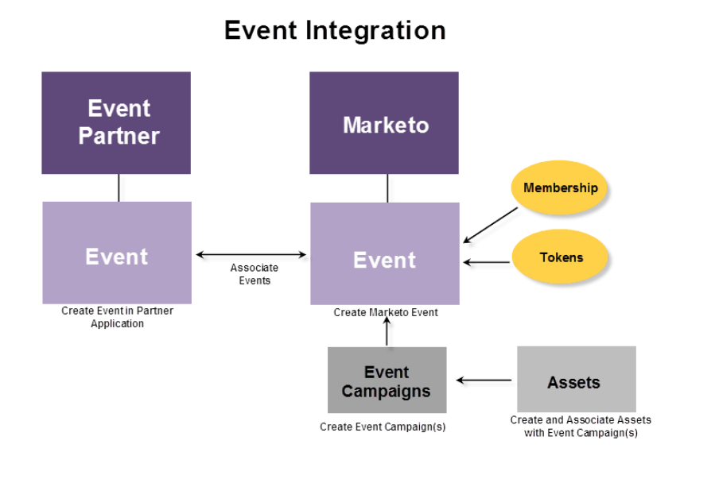

# Om Marketo On24 adapterhändelser {#understanding-marketo-on-adapter-events}

Om ditt ON24-webbinarium inte är kopplat till Marketo måste du hämta deltagarinformation som redan finns i Marketo och ange den i ON24. Efter webbinariet måste du ta närvaroinformation som redan finns i ON24 och ange den igen i Marketo.

ON24-adaptern utför all informationsöverföring åt dig. Den överför registreringsinformation som samlats in på en Marketo-landningssida till ON24 och hämtar automatiskt närvaroinformation till en Marketo-händelse.

De här artiklarna hjälper dig att skapa ett webbinarium i ON24, skapa en händelse i Marketo och associera dem.

Bilden nedan visar integrationsprocessen.

Vill du börja? Börja med [Skapa en händelse med ON24-adaptern](/help/marketo/product-docs/demand-generation/events/create-an-event/create-an-event-with-the-marketo-on24-adapter.md).

>[!MORELIKETHIS]
>
>[Skapa en händelse med Marketo ON24-adaptern](/help/marketo/product-docs/demand-generation/events/create-an-event/create-an-event-with-the-marketo-on24-adapter.md)
