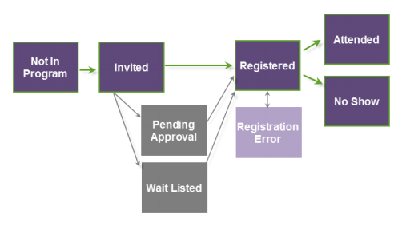

# Om status för webbinarium {#understanding-webinar-program-statuses}

Programstatus representerar olika händelsestatusar som en person går igenom som medlem i händelsen. De är kopplade till en kanaltyp. Marketo har en inbyggd kanaltyp som heter **Webinar**. Statuser kan användas i både batch- och utlösarkampanjer.

Människor rör sig linjärt genom programstatusarna och går inte tillbaka i status. En person med statusen **Attended** kan till exempel inte gå tillbaka till **Registered**.

Här är en kort beskrivning av programstatus som är kopplad till webbseminariekanalen.

>[!TIP]
>
>Om du vill uppdatera status manuellt klickar du på **Uppdatera från webbinarileverantören** i listrutan **Händelseåtgärder**.

**Inte i programmet**  - Använd den här statusen för att ta bort personer från evenemanget.

** Inbjuden** - Använd den här statusen för att lägga till personer till evenemanget.

**Väntar på godkännande**  - Använd den här statusen för att vänta med att skicka en bekräftelse via e-post till dina medarbetare. Mer information finns i&quot;Manuellt Approving Registrants&quot; i [ON24 Event Registration Updates](on24-event-registration-updates.md).

**Vänta i listan**  - Använd den här statusen om du vill att vissa personer ska vänta tills ytterligare platser blir tillgängliga.

**Avvisad**  - Använd den här statusen för att avvisa registreringen av en person till din händelse.

**Registrerad**  - Den här statusen skjuter in personer till ON24 när du använder ON24-integreringen. Personens status uppdateras när ON24 svarar på att personen registrerats korrekt.

**Registreringsfel**  - Den här statusen visar att användaren påträffade ett fel när han/hon försökte registrera sig för händelsen.

>[!NOTE]
>
>Om ett registreringsfel inträffar kan du få ytterligare information för den personen genom att titta i kolumnen Statusorsak på fliken Medlemmar i programmet. När felet är åtgärdat kan du manuellt ändra användarens programstatus till Registrerad i Marketo.

**Deltar** - När webbinariet är klart returnerar ON24 en lista över personer som deltog. Den här statusen hämtas automatiskt till Marketo.

**Attended On-demand**  - Personer som deltog i den arkiverade versionen av webbinariet får denna status.

**No Show** - När webbinariet är klart och när närvarodata hämtas in från ON24 uppdateras status för personer som har registrerat sig men inte deltagit till No Show. Det kan ta mellan 30 minuter och 3 timmar för ON24 att förbereda den slutliga närvaroinformationen och göra den tillgänglig i Marketo.

>[!NOTE]
>
>För att Marketo ska kunna dra in statusen No Show måste personen ha registrerats *i Marketo*. Vi kan inte hämta No Shows som kommer från On24-dataflödet.

>[!MORELIKETHIS]
>
>* [Om Marketo ON24-adapterhändelser](understanding-marketo-on24-adapter-events.md)

>

