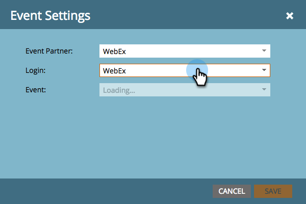

# Skapa en händelse med WebEx {#create-an-event-with-webex}

>[!NOTE]
>
>**Förutsättningar**
>
>* [Lägg till WebEx som en LaunchPoint-tjänst](/help/marketo/product-docs/administration/additional-integrations/add-webex-as-a-launchpoint-service.md)
>* [Skapa ett nytt händelseprogram](/help/marketo/product-docs/demand-generation/events/understanding-events/create-a-new-event-program.md)
>* Ange lämpliga [flödesåtgärder](http://docs.marketo.com/display/DOCS/Flow+Actions)för att spåra engagemang

Skapa först en WebEx-händelse i WebEx Event Center. Marketo använder bara specifika inställningar och fält för din integrering, som vi kommer att gå igenom inom kort. Andra fält som du kanske vill konfigurera för WebEx beskrivs i användarhandboken för [WebEx Event Center](http://www.cisco.com/c/dam/en/us/td/docs/collaboration/meeting_center/wbs298/wx_ec_host_ug.pdf).

## Grundläggande information {#basic-information}

* **Händelsenamn -** Det här namnet kan visas i Marketo.
* **Kryssrutan Ej listrerad**

   * Vi rekommenderar att du **inte** listar evenemanget. Detta säkerställer att alla människor registrerar sig via din Marketo-landningssida. Personer som registrerar via en annan mekanism än Marketo visas i Marketo efter att evenemanget har avslutats OCH endast om de deltog i evenemanget.
   * Om du väljer att lista evenemanget visas det på sidan Lista över händelser för alla som besöker din Event Center-webbplats.

* **Registrering -** Markera den här rutan om du vill ange &quot;required&quot;. Du använder ett Marketo-formulär/en landningssida för att samla in registreringsinformation som ska skickas till WebEx.
* **Händelselösenord**- (valfritt) Om du använder det här fältet måste du ta med det i bekräftelsemeddelandet!

## Datum och tid {#date-time}

* **Startdatum** - Ange startdatum. Den här visas i Marketo.

* **Starttid** - Ange starttid. Den här visas i Marketo.

* **Beräknad varaktighet** - Ange händelsens varaktighet. Den här visas i Marketo.

* **Tidszoner** - Ange tillämpliga tidszoner. De kommer att kunna ses i Marketo.

## Inställningar för ljudkonferens {#audio-conference-settings}

De här inställningarna finns endast i WebEx. De används inte av eller kan inte visas i Marketo, men de kan vara viktiga för ditt webbinarium, så dubbelkontrollera dem!

## Händelsebeskrivning och -alternativ  {#event-description-options}

Följande alternativ används av eller kan visas i Marketo. Andra fält finns endast i WebEx.

* **Beskrivning** - Ange en beskrivning. Detta kan visas men inte ändras i Marketo.
* **Undersökning** efter evenemang - Marketo kan för närvarande inte samla in information i WebEx-enkäter.
* **Mål-URL** - (valfritt) Du kan ange URL:en för en Marketo-landningssida som ska fungera som mål-URL:en som ska visas när sessionen är slut.

## Deltagare och registrering {#attendees-registration}

Du kommer att styra inbjudningslistan, registreringsformuläret och andra e-postmeddelanden med hjälp av en Marketo-händelse. Marketo stöder inte andra funktioner, bland annat:

* **Maximalt antal registranter** - **stöds för närvarande inte** med Marketo-WebEx-integreringen.  Manuellt godkännande av registranter är tillgängligt med statusen Väntande godkännande progressivt i Marketo.

* **Registrerings-ID krävs** - Stöds för närvarande med integreringen Marketo-WebEx. Du kan använda Marketo för att skicka bekräftelsemeddelandet för din händelse via e-post. När personen registrerar sig får han/hon en unik URL som han/hon använder för att ange händelsen.

   >[!TIP]
   >
   >Om du vill fylla i bekräftelsemeddelandet med den här unika URL-adressen använder du följande token i e-postmeddelandet: `{{member.webinar url}}`. När bekräftelse-URL:en skickas, tolkas denna token automatiskt till personens unika bekräftelse-URL.
   >
   >Ange bekräftelsemeddelandet till **Operational** för att säkerställa att personer som registrerar sig och kan avbeställa prenumerationen fortfarande får sin bekräftelseinformation.

* **Registreringslösenord** - (valfritt) stöds för närvarande inte med Marketo-WebEx-integrering.
* **Godkännanderegler** - stöds för närvarande inte med Marketo-WebEx-integrering. Men ni kan använda smarta kampanjer i Marketo för att styra godkännanden.

### Presentatörer och paneler {#presenters-panelists}

Informationen som konfigureras i det här avsnittet skickas inte till Marketo.

### E-postmeddelanden {#email-messages}

Du kommer att använda Marketo för att skicka ut e-postmeddelanden till dina registranter, bekräftelsemeddelanden osv. Du behöver inte konfigurera något i det här avsnittet. Inaktivera (avmarkera) alternativen för e-postmeddelanden i WebEx.

>[!NOTE]
>
>Marketo-WebEx-integreringen har inte stöd för att skicka bekräftelsemeddelanden från WebEx. Bekräftelsen måste skickas via Marketo. När du har schemalagt evenemanget måste du kopiera händelseinformationen till Marketos bekräftelsemeddelande och ange e-postmeddelandet som **operativt**.

Nu är vi redo att börja använda Marketo!

1. Markera händelsen som du skapade. Öppna listrutan **Händelseåtgärder** . Välj **Händelseinställningar.**

   

   >[!NOTE]
   >
   >Kanaltypen för den valda händelsen måste vara **webbinarium**.

1. Under **Event Partner** väljer du **WebEx**.

   

1. Under **Login** väljer du WebEx-inloggning.

   

1. Under **Event** väljer du den nyligen skapade WebEx-händelsen. Välj sedan en valfri sida för säkerhetskopiering och klicka på **Spara**.

   

1. Välj en valfri säkerhetskopieringssida för WebEx-händelsen. Välj i listrutan över godkända Marketo-landningssidor eller ange webbadressen till en icke-Marketo-landningssida.

   >[!TIP]
   >
   >Ange en säkerhetskopieringssida för att dirigera en medlem till en viss sida om de klickar på deras anpassade händelse-URL före händelsens starttid.

   >[!NOTE]
   >
   >Fälten som Marketo skickar är: Förnamn, efternamn, e-postadress.

   

   >[!CAUTION]
   >
   >Undvik att använda kapslade e-postprogram för att skicka ut bekräftelsemeddelanden. Använd händelseprogrammets smarta kampanj i stället, som visas ovan.

   >[!TIP]
   >
   >Det kan ta upp till 48 timmar innan data visas i Marketo. Om du fortfarande inte ser något efter att ha väntat så länge väljer du **Uppdatera från webbinariet Provider** på menyn Händelseåtgärder på fliken **Sammanfattning** i händelsen.

Söt! Din WebEx-händelse synkroniseras nu med din Marketo-händelse.  Personer som registrerar sig för ditt webbinarium kommer att pushas till din webbinarileverantör via flödessteget Ändra programstatus när Ny status är inställd på&quot;Registrerad&quot;. Ingen annan status kommer att föra personen över. Se även till att du följer flödessteget Ändra programstatus 1 och Skicka e-postflöde 2.

## Visa schemat  {#viewing-the-schedule}

Klicka på kalenderposten för din aktivitet i [programschemavyn](http://docs.marketo.com/display/docs/program+schedule+view). Schemat visas till höger på skärmen.

>[!NOTE]
>
>Om du vill ändra ditt evenemangsschema måste du redigera webbinariet på WebEx.
