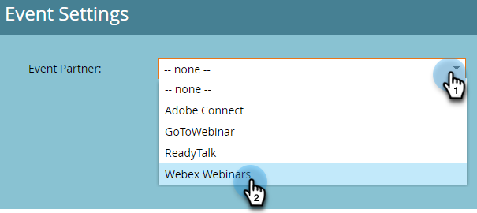

# Skapa en händelse med Webex {#create-an-event-with-webex}

När du har skapat ett webbinarium i Webex måste du synkronisera ditt event med Marketo Engage.

>[!PREREQUISITES]
>
>* [Lägg till webb som en LaunchPoint-tjänst](/help/marketo/product-docs/administration/additional-integrations/add-webex-as-a-launchpoint-service.md)
>* [Skapa ett nytt händelseprogram](/help/marketo/product-docs/demand-generation/events/understanding-events/create-a-new-event-program.md)
>* Ange lämplig [flödesåtgärder](/help/marketo/product-docs/core-marketo-concepts/smart-campaigns/flow-actions/add-a-flow-step-to-a-smart-campaign.md) för att spåra engagemang

## Schemalägg ditt webbinarium {#schedule-your-webinar}

Du schemalägger din aktivitet och väljer önskade inställningar i [Webex](https://www.webex.com/){target="_blank"}. Only the following information is viewable in Marketo: webinar name, start/end date & time, time zone, and description. Additional information about Webex Webinars [can be found here](https://help.webex.com/en-us/landing/ld-7srxjs-WebexWebinars/Webex-Webinars){target="_blank"}.

### Grundläggande information {#basic-information}

* **Ämne**: Detta är ditt händelsenamn och kan visas i Marketo.
* **Datum och tid**: Start-/slutdatum, start-/sluttid, varaktighet och tidszon kan visas i Marketo.
* **Maximalt antal deltagare**: Det maximala antalet deltagare avgör vilka WebBex-funktioner som stöds.
* **Webbcast-vy för deltagare**: Markera detta om du vill att ditt webbinarium ska direktuppspelas till alla deltagare.
* **Panelister**: Bjud in specifika personer att bli panelister på ditt webbinarium.
* **Dagordning för webbinarium**: Fyll i detta om du vill ange kontext i den e-postinbjudan som skickas till panelerna.

### Säkerhet {#security}

* **Webbinarium, lösenord**: (valfritt) Om du använder det här fältet måste du ta med det i bekräftelsemeddelandet.
* **Panelist password**: (valfritt) Om du använder det här fältet måste du ta med det på webbseminariets dagordning.
* **Kräv konto**: Begränsar deltagare till endast de som har Webex-konton.

### Alternativ för ljudanslutning {#audio-connection-options}

* **Typ av ljudanslutning**: Välj hur webbinariet ska delta i ljuddelen av webbinariet.
* **Ton för in- och utträde**: Välj det ljud som du vill att användare ska använda när någon går in i eller ut ur webbinariet (anslutning av telefonljud krävs).
* **Ljud av panelistan**: Välj önskade inställningar för tyst i panelistan.

### Avancerade alternativ {#advanced-options}

* **Automatisk inspelning**: Markera detta om du vill att webbinariet ska spelas in automatiskt.
* **Öva session**: Kontrollera att en övningssession har startats när webbinariet börjar.
* **Brytningssessioner**: Med brytningssessioner kan du förtilldela paneler och deltagare innan webbinariet startar, eller låta dem ansluta under webbinariet.
* **Webbinarier**: Genom att lägga till i en webbinarieserie kan man se webbinariet oavsett om det är offentligt eller inte.
* **Registrering**: Kräver att deltagarna registrerar sig och får värdgodkännande innan de går med.
* **Påminnelse via e-post**: Välj en påminnelse från 15 minuter innan webbinariet startar upp till två dagar.
* **Alternativ för webbinarier**: Avgör vilka funktioner som är tillgängliga för deltagare i webbinariet.
* **Deltagarbehörigheter**: Deltagarbehörigheter avgör vilka åtgärder som är tillgängliga för webbinariets deltagare.

>[!NOTE]
>
>Integreringen av Marketo-Webex stöder inte sändning av bekräftelsemeddelanden från Webex. Bekräftelsen måste skickas via Marketo. När du har schemalagt evenemanget måste du kopiera händelseinformationen till bekräftelsemeddelandet från Marketo och ange e-postmeddelandet som _Operativ_.

## Synkronisera din aktivitet med Marketo Engage {#sync-your-event-with-marketo-engage}

1. I Marketo söker du efter och väljer önskat Event Program. I **Händelseåtgärder** nedrullningsbar meny, välja **Händelseinställningar**.

   

   >[!NOTE]
   >
   >Kanaltypen för den valda händelsen måste vara **webbinarium**.

1. I **Evenemangspartner** nedrullningsbar meny, välja **Webex Webinars**.

   

1. I **Inloggning** väljer du din webbex-inloggning.

   

1. I **Händelse** väljer du en Webex-händelse.

   

1. Din webbseminarieinformation fylls i. Klicka **Spara**.

   

Ditt Webex-event har nu synkroniserats med ditt Marketo Event Program. Personer som registrerar sig för ditt webbinarium kommer att bli puffade för ditt webbinarium via _Ändra programstatus_ flödessteg när den nya statusen är inställd på &quot;Registrerad&quot;. Ingen annan status kommer att föra personen över. Var noga med att _Ändra programstatus_ flödessteg 1, och _Skicka e-post_ flödessteg 2.

## Saker att notera {#things-to-note}

* Undvik att använda kapslade e-postprogram för att skicka ut bekräftelsemeddelanden. Använd ert Event Program Smart Campaign i stället.

* Det kan ta upp till 48 timmar innan data visas i Marketo. Om du fortfarande inte ser något efter att ha väntat så länge klickar du på **Uppdatera från webbseminarieleverantör** i **Händelseåtgärder** listrutan i **Sammanfattning** -fliken i ditt Event Program.
