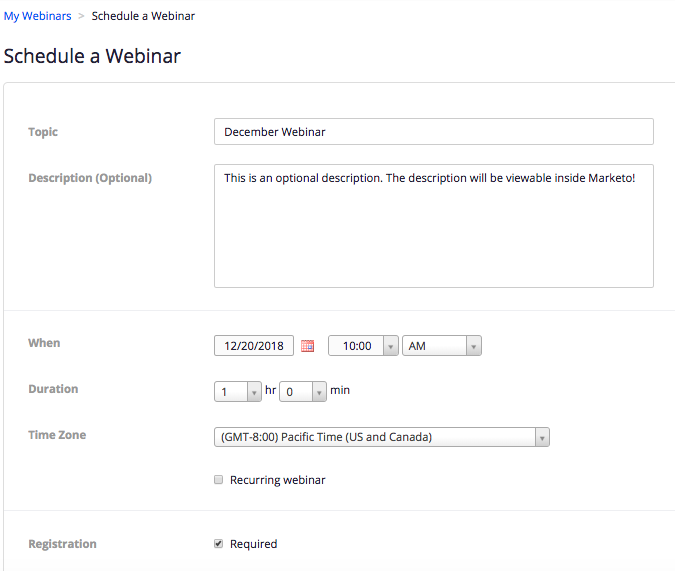

# Skapa en händelse med zoomning {#create-an-event-with-zoom}

>[!PREREQUISITES]
>
>* [Lägg till zoom som en LaunchPoint-tjänst](/help/marketo/product-docs/administration/additional-integrations/add-zoom-as-a-launchpoint-service.md)
>* [Skapa ett nytt händelseprogram](/help/marketo/product-docs/demand-generation/events/understanding-events/create-a-new-event-program.md)
>* Ange lämpliga [flödesåtgärder](/help/marketo/product-docs/core-marketo-concepts/smart-campaigns/flow-actions/add-a-flow-step-to-a-smart-campaign.md)för att spåra engagemang

Skapa först ditt webbinarium i Zoom. Vissa inställningar när du skapar zoomning används av Marketo och vissa används bara av Zoom.

När du har skapat en Marketo-händelse och associerat ett Zoom-webbinarium med den kan systemen dela registrerings- och närvaroinformation. Hjälp med att skapa ett webbinarium finns i [Komma igång med zoomwebbinarier](https://support.zoom.us/hc/en-us/articles/200917029-Getting-Started-With-Webinar).

Ange följande information för ditt webbinarium så hämtas det till Marketo via adaptern. Om du gör några ändringar i den här informationen måste du klicka på länken&quot;Uppdatera från webbinarium-leverantör&quot; under Händelseåtgärder för att Marketto ska kunna se ändringarna.

**Titel och beskrivning**

* **Namn**  på webbinarium - Ange namnet på webbinariet. Det här namnet kan visas i Marketo.

* **Beskrivning**  (valfritt) - Ange beskrivningen för webbinariet. Beskrivningen kan`visas i Marketo.

**Datum och tid**

* **Startdatum**  - Ange startdatum. Den här visas i Marketo.

* **Starttid**  - Ange starttid. Den här visas i Marketo.

* **Varaktighet**  - Ange längden. Starttiden och sluttiden visas i Marketo.

* **Tidszon**  - Välj önskad tidszon. Den här visas i Marketo.

* **Återkommande webbinarium** - Behåll avmarkerat.

* **Registrering**  - Markera den här kryssrutan om du vill göra registreringen obligatorisk. Du använder en Marketo-formulär/landningssida för att hämta registreringsinformation som ska överföras till Zoom.

>[!NOTE]
>
>Marketo stöder för närvarande inte återkommande webbinarier. Du måste konfigurera en session mellan varje Marketo Event- och Zoom-webbinarium.

>[!TIP]
>
>Det finns ytterligare fält som du konfigurerar i Zoom som INTE påverkar integreringen. Mer information om dessa fält finns i [Zoom Webinar Help Center](https://support.zoom.us/hc/en-us/sections/200324965-Video-Webinar).

Nu går vi till Marketo!

1. Välj en händelse. Klicka på **Händelseåtgärder** och välj **Händelseinställningar**.

   

   >[!NOTE]
   >
   >Kanaltypen för den valda händelsen måste vara **webbinarium**.

1. Välj **Zooma** i **Event** **Partner**-listan.

   

1. Välj det zoomkonto som du vill associera händelsen med.

   

1. Välj webbinariet.

   

1. Klicka på **Spara**.

   

   Underbar! Nu synkroniseras händelsen och schemaläggs av Zoom.

   >[!NOTE]
   >
   >Fälten som Marketo skickar är: Förnamn, efternamn, e-postadress.

   >[!TIP]
   >
   >Om du vill fylla i bekräftelsemeddelandet med den här unika URL-adressen använder du följande token i e-postmeddelandet: `{{member.webinar url}}`. När bekräftelse-URL:en skickas, tolkas denna token automatiskt till personens unika bekräftelse-URL.
   >
   >Ange din bekräftelse via e-post till **Operational** för att säkerställa att personer som registrerar sig och kan avbeställa prenumerationen fortfarande får sin bekräftelseinformation.

   Personer som registrerar sig för ditt webbinarium kommer att pushas till din webbinarileverantör via flödessteget **Ändra programstatus** när Ny status är inställd på &quot;Registrerad&quot;. Ingen annan status kommer att föra personen över. Se även till att flödesteget **Ändra programstatus** är 1 och **Skicka e-post** flödessteg 2.

   

   >[!CAUTION]
   >
   >Undvik att använda kapslade e-postprogram för att skicka ut bekräftelsemeddelanden. Använd händelseprogrammets smarta kampanj i stället, som visas ovan.

   >[!TIP]
   >
   >Det kan ta upp till 48 timmar innan data visas i Marketo. Om du fortfarande inte ser något efter att ha väntat så länge väljer du **Uppdatera från webbinariet Provider** på menyn Händelseåtgärder på fliken **Sammanfattning** för din händelse.
