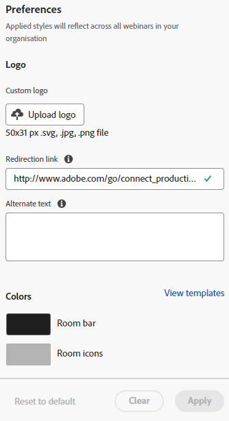

# Anpassning av interaktiva webbinarier {#interactive-webinars-customization}

Att anpassa webbinarierna är avgörande för att skapa en mer engagerande och effektiv upplevelse för deltagarna.

Interaktiva webbinarier erbjuder flera anpassningsalternativ för att skräddarsy webbinariet efter dina behov. Anpassa utseendet på olika skärmar så att det passar er organisations varumärke.

Du kan anpassa följande alternativ:

* Varumärkesfärger för rummet
* Anpassad bakgrund som representerar din organisation på skärmar för inträde, avslut och väntetider
* Logotyp
* Virtuella videobakgrunder

## Anpassa interaktiva webbinarier {#customize-interactive-webinar-screens}

1. Gå till **Design Studio**.

   

1. Klicka på **Interaktiva webbinarier** och välj **Anpassa webbinarier**.

   

1. Du kan anpassa rumsgränssnittet, snabbskärmar eller virtuella videobakgrunder.

   

### Anpassa rummets gränssnitt {#customize-the-room-interface}

Du kan anpassa utseendet på sessionsrummet genom att ändra logotyp, klickbar omdirigeringslänk och färger. Ändringarna återspeglas i alla evenemang och rum i organisationen.

Om du vill anpassa utseendet på ett rum väljer du fliken för rumsgränssnittet på menyraden.

1. Anpassa följande inställningar från den högra panelen:

   

   **Egen logotyp**: Välj Överför logotyp och bläddra i bilden från enheten. Bildstorleken får inte överstiga 50 x 31 pixlar och kan vara i olika filformat: .svg, .gif, .jpg och .png. Du kan ändra eller ta bort din logotyp.

   **Länk för omdirigering**: Lägg till en URL för att omdirigera dina deltagare när de har klickat på logotypen.

   **Alternativ text**: Lägg till en alternativ text för deltagare med tillgänglighetsfunktioner.

   **Färger**: Välj färger för rumsfältet, rumsikoner, rumsbakgrund, rutfält och rutor/ikoner för att ändra färg för olika avsnitt.

   Du kan också ange HEX-färgkoden med alternativet HEX.

   Välj **[!UICONTROL View templates]** om du vill ändra rummets tema.

   När du har gjort ändringarna kan du kontrollera logotypen och färgerna i förhandsvisningen.

1. Välj **[!UICONTROL Apply]** om du vill spara ändringarna. Klicka på **[!UICONTROL Reset to default]** om du vill återställa standardinställningarna.

   

### Anpassa mellanskärmar {#customize-intermediate-screens}

Ändra bakgrundsbilden för att ändra utseendet på ingångs-, avslutnings- och vänteskärmarna. Ändringarna återspeglas i alla evenemang och rum i organisationen.

Om du vill anpassa utseendet på ett rum väljer du fliken Mellanskärmar på menyraden.

1. Anpassa bakgrundsbilden från den högra panelen genom att välja **Överför bild** och bläddra efter en logotyp i en bild. Bildstorleken får inte överstiga 1 920 x 1 080 pixlar och kan vara i olika filformat: .svg, .gif, .jpg och .png. Du kan ändra eller ta bort logotypen om du vill.

   

   >[!NOTE]
   >
   >Den överförda bilden används på skärmarna Inmatning, Avsluta och Väntar.

1. Välj **[!UICONTROL Apply]** om du vill spara ändringarna. Klicka på **[!UICONTROL Reset to default]** om du vill återställa standardinställningarna.

### Anpassa virtuella videobakgrunder {#Customize-virtual-video-backgrounds}

Använd organisationsdefinierade bakgrunder under evenemanget för att visa organisationens logotyp eller varumärkeskopia i bakgrunden av videomatningen från kameran. Om du vill lägga till organisationens virtuella bakgrunder väljer du fliken Virtuella videobakgrunder på menyraden. Du kan välja att endast visa anpassade bakgrunder, Adobe Connect-bakgrunder eller båda.

**Anpassade bakgrunder**

1. Klicka på växlingsknappen för att tillåta anpassade bakgrunder i dina händelser och rum.

   

1. Välj **Överför bakgrund** om du vill överföra en anpassad bakgrund. Bildstorleken får inte överstiga 1 920 x 1 080 pixlar och kan vara i olika filformat: .svg, .gif, .jpg och .png.

Håll pekaren över den anpassade bakgrundsbilden för att ta bort den från videobakgrunder.

Visa bakgrunden i förhandsvisningen när du har gjort ändringarna.

Du kan använda skjutreglaget på förhandsgranskningsskärmen för att zooma in eller ut och testa hur den virtuella bakgrunden skulle se ut om användaren var nära eller långt från kameran. Om det finns någon text i bakgrunden är det här en garanti för att den inte visas.

1. Välj **[!UICONTROL Apply]** om du vill spara ändringarna. Klicka på **[!UICONTROL Reset to default]** om du vill återställa standardinställningarna.

**Adobe Connect bakgrunder**

Adobe Connect har nio standardbakgrunder som är klara att användas. Du kan se deras utseende i Förhandsgranska.

Använd växlingsknappen för att kontrollera tillgängligheten för dessa standardbakgrunder i dina händelser och rum.

Välj **Använd** om du vill spara ändringarna eller **Återställ till standard** om du vill återställa standardinställningarna.
