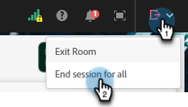

# Leverera ett interaktivt webbinarium {#deliver-an-interactive-webinar}

Ditt interaktiva webbinarium är klart att användas. Lär dig allt du behöver veta om hur du presenterar det.

1. Markera din aktivitet och klicka på **Ange ditt webbinarium**.

   

   >[!NOTE]
   >
   >Vi rekommenderar att du gör detta minst 15 minuter före den schemalagda starttiden.

1. Om du är en medvärd eller presentatör klickar du på den personliga länken i det e-postmeddelande du fick för webbinariet.

1. Välj dina inställningar för ljud/video och klicka på **Ange rum**.

   

1. Välj den layout som ska visas för tidiga medlemmar.

   

   >[!NOTE]
   >
   >Deltagarna kan gå in i rummet upp till 15 minuter före den schemalagda starten och se den aktiva layouten. Vi rekommenderar att du utformar en Lobby-layout åt dem.

   >[!TIP]
   >
   >Aktivera sändningskontroller för att gå in i ett virtuellt grönt rum. På så sätt kan värdarna och presentatörerna tala privat och se varandra utan att ljudet och videon sänds till deltagarna i rummet. Det är idealiskt före och efter sessionen, där du kan testa ljud och video eller rundtur efter webbinariet.

1. Du kan spela in sessionen om det behövs. Välj **Spela in session** på rumsmenyn. Inspelningen kan stoppas senare från samma meny.

   

1. Sessionen börjar vid den angivna tidpunkten.

1. Klicka på rummets namn. I listrutan väljer du **Värd- och presentatörsområdet** om du vill chatta eller dela anteckningar med presentationsteamets backstage. Värd- och presentatörsområdet öppnas på skärmens högra sida. Det är bara värdar, kollegor och presentatörer som kan se den här delen av skärmen.

   

1. När sessionen är klar klickar du på den röda pilen och väljer **Avsluta session för alla**.

   

   >[!CAUTION]
   >
   >Om du klickar på rummet för att lämna rummet lämnar du bara rummet. Det kommer **inte** att avsluta webbinariet.

   >[!TIP]
   >
   >Läs mer om [händelseprestanda och inspelningar](/help/marketo/product-docs/demand-generation/events/interactive-webinars/event-workflows.md){target="_blank"}.

## Deltagarupplevelse {#participant-experience}

Deltagare kan gå med i webbinariet genom att klicka på den personliga länken som tas emot efter registreringen av evenemanget.

1. Deltagare som startar händelselänken mer än 15 minuter innan den schemalagda starten ser en startsida som informerar dem om att de väntar på att evenemanget ska starta.

   

1. Deltagarna måste välja sina ljudinställningar och sedan klicka på Enter room. Deltagare som går med i ett Adobe Connect-rum för första gången ser också en webbläsarpopup för mikrofontillstånd. Adobe Connect behöver den här åtkomsten för att deltagarna ska kunna använda mikrofonen senare i rummet.

   

   >[!NOTE]
   >
   >Behörighetsfönstret kan stängas utan åtkomst. Deltagarna måste ge åtkomst i rummet om de försöker aktivera sin mikrofon.

## Inställningar och områden {#settings-and-areas}

### Värd- och föredragshållarområde {#host-and-presenter-area}

&quot;Värd- och presentatörsområdet&quot; (kallas även &quot;Backstage&quot;) är ett privat område som finns till höger om ett mötesrum som bara värdar och presentatörer kan se. Den kan användas för att samarbeta före, under och efter en händelse. Använd chatt, anteckningar och andra poder som bakkanaler i området Värd och presentatör.

Välj **Värd- och föredragshållarområde** i rumsmenyn för att få åtkomst till området. Läs mer om det här området i [följande video](https://www.youtube.com/watch?v=11GkcvIUttY){target="_blank"}.

### Sändningskontroller {#broadcast-controls}

Broadcast Control lägger till ett virtuellt grönt rum i din interaktiva webbinariesession. Det gör det möjligt för värdar och presentatörer att tala och se varandra privat utan att behöva sända något till deltagarna i rummet. Det är ett bra sätt att testa mikrofonen och webbkameran före en session. Presentatörer kan också samarbeta i värd- och presentatörsområdet tills de är klara att publicera. Det ger talaren och producenterna möjlighet att diskutera privat efter en session om en deltagare glömmer att lämna webbinariet.

Sändningskontroller kan ställas in så att inspelningen startar automatiskt när du lämnar det gröna rummet. Detta garanterar att värdarna inte behöver komma ihåg att starta och stoppa inspelningen manuellt. Om du pausar eller stoppar sändningen pausas eller stoppas även inspelningen. Allt är automatiskt.

Läs mer om sändningskontroller [&#x200B; i den här videon](https://www.youtube.com/watch?v=TcoCeEJoyjg){target="_blank"}.

### Chatt i inspelningar {#chats-in-recordings}

Beroende på användningsfallet kan det vara en bra idé att antingen inkludera eller exkludera chatten i rummet i händelseinspelningarna.

Diskussioner i Chatt-rutorna spelas alltid in. Om chattdiskussioner tillför värde till visningsprogram (deltagare och on-demand-användare publicerar live-evenemanget) använder du chattrutorna när du designar rummet.

Diskussionen i panelen Chatt spelas inte in. På chattpanelen frigörs också den egendom som skulle ha varit upptagen av chattrutan i layouten. Om chattdiskussionerna inte ska ge tittarna något mervärde använder du chattpanelen i stället för chattrutorna när du designar rummet.

Läs mer om [chattpanelen](https://helpx.adobe.com/adobe-connect/using/notes-chat-q-a-polls.html#chat_panel){target="_blank"}.

### Förbered läge {#prepare-mode}

Med Förbered Mode kan värdar och presentatörer skapa eller ändra en mötesrumslayout bakom scenerna medan en session pågår, men utan att deltagarna ser ändringarna förrän värden gör dem synliga. Funktionen Förbered läge markerar de aktiva rutorna i blå och icke-aktiva rutor i vitt.

Så här använder du läget Förbered:

1. Klicka på skiftnyckelsikonen längst ned på panelen Layouter.

   

1. På panelen Layouter väljer du den layout som du vill justera. Flytta, dölj eller visa rutor efter behov. Du kan även uppdatera innehållet i rutor som att överföra en ny version av presentationen i en delningsruta.

1. När ändringarna är klara väljer du **Avsluta förberedelseläge** i listrutan eller klickar på skiftnyckelsikonen en andra gång.

Detta stänger av Förbered-läge och återställer dig till den aktiva layouten.

Läs mer om Förbered läge [&#x200B; i den här videon](https://www.youtube.com/watch?v=kUya84sx-E4){target="_blank"}.

>[!NOTE]
>
>* Alla ändringar som görs i de aktiva områdena återspeglas direkt för deltagarna.
>* [Panelen Chatt](https://helpx.adobe.com/adobe-connect/using/notes-chat-q-a-polls.html#chat_panel){target="_blank"} är inte en del av läget Förbered och eventuella ändringar av den visas omedelbart för deltagarna.

### Tillgänglighet {#accessibility}

Adobe strävar efter att inkludera presentatörer och deltagare med funktionshinder genom att förbättra tillgängligheten till interaktiva webbinarier. Programmen har ständigt förbättrats för att uppfylla behoven hos alla typer av användare och för att uppfylla de världsomspännande standarder som omfattar personer med nedsatt syn, hörsel, mobilitet eller andra funktionshinder.

Lär dig mer om hur Adobe Connect kan hjälpa [användare med visuella, auditiva och mobila funktioner](https://helpx.adobe.com/adobe-connect/using/accessibility-features.html){target="_blank"}.

### Undertexter {#closed-captions}

Undertexter är en textrepresentation av ljudet i ett Adobe Connect-rum och hjälper deltagare som är döva eller hörda att delta i event. Du kan integrera bildtexter av ljudinnehåll i realtid i händelser och presentera dessa bildtexter i bildtextvisningen.

Lär dig [aktivera undertexter](https://helpx.adobe.com/adobe-connect/using/closed-captioning-html-client.html){target="_blank"}.

### Simulerade webbinarier {#simulated-live-webinars}

Presentera inspelade webbinarier som om de var live i Simulated Live-webbinariet. Deltagarna kan delta vid en schemalagd tidpunkt och uppleva sessionen i realtid med interaktiva funktioner som chatt, omröstningar och frågor och svar. Simulerade webbinarier i Live kombinerar tillförlitligheten hos inspelat innehåll med den interaktiva upplevelsen av en live-event.

Läs mer om [Simulerade webbinarier](https://helpx.adobe.com/adobe-connect/using/webinar/overview-of-simulated-live-webinars.html){target="_blank"}.
