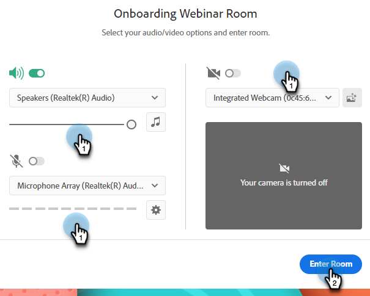

# Designa interaktiva webbinarier {#designing-interactive-webinars}

Lär dig hur du utformar ett webbinarium som passar dina behov.

1. Välj aktiviteten och klicka på **Design Webinar**.

   

1. Du kan välja ett befintligt webbinarium eller skapa ett nytt. I det här exemplet skapar vi en ny, så klicka på **Välj rum** nedrullningsbar meny och välj **Nytt interaktivt webbinarium**.

   

   >[!NOTE]
   >
   >Ett rum är ett onlinerum som används för att genomföra möten.

1. Välj en mall.

   

1. Din förhandsgranskning av webbinariet visas.

   

1. Du kan välja olika layouter att förhandsgranska. Klicka på **Använd mall**.

   

1. Du kan förfina ditt webbinarium direkt eller senare. Låt oss göra det nu. Klicka **Förfina ert webbinarium nu**.

   

1. Välj inställningar för ljud/video och klicka på **Ange rum**.

   

1. Den valda mallen kan nu redigeras.

   

1. Mer information om rum och mallar finns i avsnittet&quot;Mötesrumsmallar och layouter&quot; i [den här hjälpartikeln för Adobe](https://helpx.adobe.com/in/adobe-connect/using/creating-arranging-meetings.html#creating_and_arranging_meetings){target="_blank"}.

1. När du är klar med designen av ditt webbinarium klickar du på **Avsluta rummet**.

   

## Designelement {#design-elements}

**Mall**: Mallen är en struktur som tillhandahålls ett rum baserat på målet för det webbinarium som levereras. Om du till exempel vill schemalägga ett produktwebbseminarium är skärmdelning en viktig komponent för att visa upp demon. Mallen ser till att de nödvändiga komponenterna som krävs för en effektiv leverans av en viss typ av webbinarium finns på plats under konfigurationen av webbinariet.

**Layout**: Layout avser olika sätt på vilka de olika komponenterna som krävs för att webbseminariet ska fungera är ordnade i en viss mall. En och samma mall kan ha flera layouter att välja mellan. De viktigaste komponenterna i webbinariet är desamma för alla mallar. Det arrangemang du valt passar bäst för din eller presentatörens stil/behov.

**Pod**: Pod refererar till en komponent i en mall som utför en viss aktivitet under webbinariet. Du kan till exempel ställa in och leverera en omröstning för att samla deltagarnas svar i en aktivitet som kan utföras av en omröstning. På samma sätt kan chattsamtal med deltagarna för att förmedla ett meddelande eller för att interagera med dem via ett ögonblick vara en aktivitet som levereras via chattblocket. Det finns flera andra fönster tillgängliga, t.ex. Dela, Anteckningar, Video, Chatt, Deltagarlista, Filer, Webblänkar, Omröstningar samt Frågor och svar.
