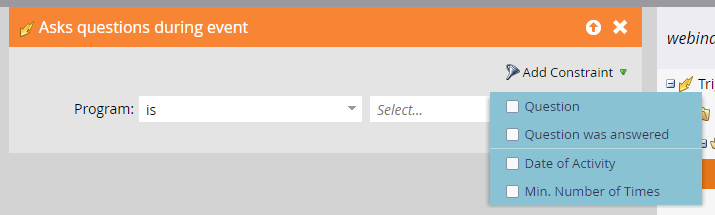

# Arbetsflöden för händelser {#event-workflows}

När webbinariet är klart går du till fliken Kontrollpanel för att se de sammanställda resultaten.

>[!NOTE]
>
>Om webbinariet inte har slutförts eller om data inte har tagits emot av någon anledning, kommer fliken Kontrollpanel inte att vara tillgänglig ännu.

## Instrumentpanelswidgetar {#dashboard-widgets}

Kontrollpanelen består av fyra widgetar.

**Status för händelseprogram**: Visar de olika programstatusarna för den händelsen och det antal medlemmar i programmet som för närvarande har det aktuella programstatusvärdet.

**Närvaro**: Framhäver närvarotiden för olika medlemmar som har deltagit i webbinariet i procent jämfört med den totala längden på webbinariet.

**Avsökningsprestanda**: Visar olika omröstningar som har startats under webbinariet i Adobe Connect och hur de medlemmar som har deltagit i och svarat på omröstningen har distribuerats för varje svar.

**Klicka och hämta filer**: Visar antalet nedladdningar av filer och webblänkar som klickats under webbinariet i Adobe Connect av olika medlemmar som har besökt webbinariet och vidtagit just den åtgärden.

## Utlösare och filter {#triggers-and-filters}

Använd interaktiva webbinarier-relaterade triggers och filter för att hitta specifika grupper av personer i ditt Event Program.

Varje utlösare/filter har ytterligare begränsningar så att du kan fånga en fokuserad delmängd av gruppen.

**Frågar frågor under evenemanget** (Filterversion: Har ställt frågor under evenemanget)

**Deltagarhändelse** (Filterversion: Har övervakad händelse)

**Klicka på en länk** (Filterversion: Klicka på en länk)

**Hämtar en resurs** (Filterversion: Hämtade en resurs)

**Svar på en omröstning** (Filterversion: Svar på en omröstning)

