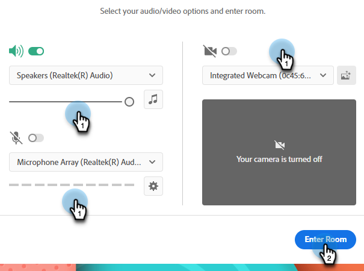
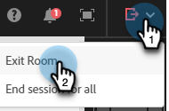
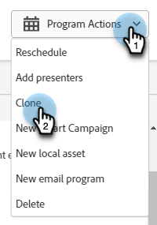
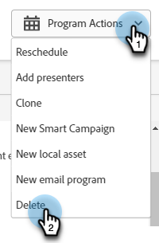
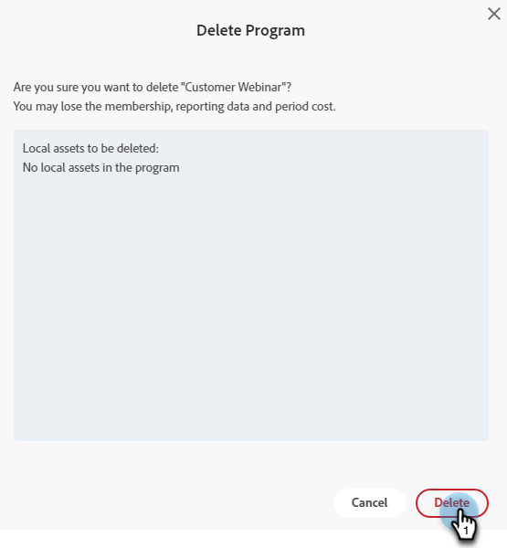

# Ändra eller ta bort ett interaktivt webbinarium {#modify-or-delete-an-interactive-webinar}

Lär dig hur du gör ändringar i ditt interaktiva webbinarium.

## Ändra ett interaktivt webbinarium {#modify-an-interactive-webinar}

1. Välj önskat händelseprogram och klicka på **Ändra rum/mall**.

   

1. Rummet läses in. Om du vill byta rum väljer du ett i listrutan Rummen. Om du bara vill uppdatera mallen klickar du på **Använd rum**.

   

>[!NOTE]
>
>Det är valfritt att ändra rummet och du behöver inte uppdatera mallen.

1. Klicka **Förfina ert webbinarium nu**.

   

1. Välj inställningar för ljud/video och klicka på **Ange rum**.

   

1. När du är klar med ändringarna klickar du på **Avsluta rummet**.

   

## Schemalägg om ett interaktivt webbinarium {#reschedule-an-interactive-webinar}

1. Välj önskat Event Program (Händelseprogram) och klicka på pennikonen bredvid det schemalagda datumet/klockslaget.

   

1. Klicka på kalenderikonen, välj det nya datumet/den nya tiden och klicka på **Spara**.

   

## Klona ett interaktivt webbinarium {#clone-an-interactive-webinar}

1. Välj önskat händelseprogram.

   

1. Klicka på listrutan Programåtgärder och välj **Klona**.

   

   >[!TIP]
   >
   >Du kan också högerklicka på Event Program (Händelseprogram) i trädet och välja **Klona** därifrån.

1. Ge det klonade programmet ett namn, ange arbetsytan och målet (om du vill att programmet ska vara någon annanstans) och klicka på **Spara**.

   

1. Klicka **Nästa**.

   

   >[!NOTE]
   >
   >Du kan bara spara ett klonat interaktivt webbinarium som interaktivt webbinarium just nu. Spara ett klonat webbinarium som Partner Webinar (t.ex. Zoom, ON24 osv.) kommer snart.

1. Välj inställningar för det klonade webbinariet och klicka på **Klona**.

   

## Ta bort ett interaktivt webbinarium {#delete-an-interactive-webinar}

1. Välj önskat händelseprogram.

   

1. Klicka på listrutan Programåtgärder och välj **Ta bort**.

   

   >[!TIP]
   >
   >Du kan också högerklicka på Event Program (Händelseprogram) i trädet och välja **Ta bort** därifrån.

1. Klicka **Ta bort**.

   

   >[!IMPORTANT]
   >
   >Om det finns lokala resurser i programmet tas de också bort.
