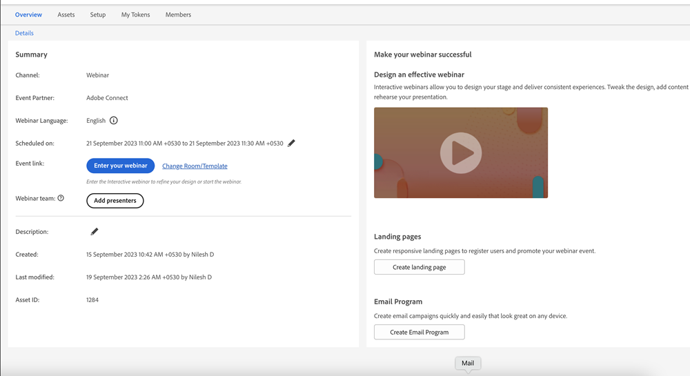

# Marknadsför ett interaktivt webbinarium {#promoting-an-interactive-webinar}

Att marknadsföra ett interaktivt webbinarium liknar att marknadsföra ett partnerwebbinarium via Launchpoint. När du skapar ett händelseprogram för interaktiva webbinarier kan du lägga till medlemmar i ett program antingen genom att köra en kampanj eller importera medlemmar till programmet. Om du vill kontrollera vilka medlemmar som har lagts till i händelseprogrammet för interaktiva webbinarier klickar du på fliken Medlemmar.

När medlemmarna har lagts till eller importerats till programmet kan du skapa en e-postkampanj i Interactive Webinar Event Program för att skicka en inbjudan till alla programmedlemmar och ändra deras status till&quot;inbjudna&quot; när e-postmeddelandet har levererats.

E-postmeddelandet kan innehålla specifika detaljer om programmet samt en URL till en landningssida som skulle dirigera om mottagaren till en viss sida där mer information om webbinariet (t.ex. innehåll, presentatörsinformation osv.) kan läggas till. Denna landningssida kan skapas som en lokal resurs i Interactive Webinars Event Program.

Du kan begära registrering för det här webbinariet genom att aktivera ett formulär på landningssidan och länka formulärklickningarna till aktiverad registrering i händelseprogrammet för interaktiva webbinarier. En kampanj som använder formulärinlämning som utlösare och ändrar programstatus från&quot;inbjuden&quot; till&quot;registrerad&quot;.

>[!NOTE]
>
>Övergången från&quot;inbjuden&quot; till&quot;registrerad&quot; är inte automatisk i interaktiva webbinarier eftersom det kan finnas flera utlösare som skapar övergången.

När en medlem har varit med i det&quot;registrerade&quot; programmet i ett händelseprogram för interaktiva webbinarier registreras det automatiskt i det webbinarium som skapats i Adobe Connect. Registreringsdata som Förnamn, Efternamn och E-post-ID överförs sedan till Adobe Connect. Det innebär att när användaren ansluter sig till webbinariet som deltagare blir informationen tillgänglig för presentatören eller värden under webbinariet.

Inom några minuter efter registreringen fylls URL:en för webbinariet för medlemmen i på fliken Medlemmar. Om du inte hittar kolumnen för webbinariets URL kontrollerar du att kolumnen har lagts till i vyn. Det här är en personlig URL för varje registrerad medlem som kan ange webbinariet vid schemalagd tidpunkt utan att någon autentisering krävs. Token som utbyts internt tar hand om medlemmarnas autentisering.

Du kan använda variabler för att inkludera webbinariets URL till enskilda medlemmar i en e-postkampanj för att meddela att de har registrerats i händelsen och för att använda den URL som ska användas för att ange webbinariet vid den schemalagda tidpunkten. Kalendertoken kan användas i samma e-postkampanj för att säkerställa att webbinariet kan läggas till i medlemmarnas kalendrar.

Länkarna finns till höger på fliken Översikt i ditt Event Program för att skapa en landningssida samt en e-postkampanj. Resten av kampanjerna för en händelse är desamma som för partnerwebbinarier som använder integreringen med Launchpoint.

