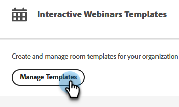
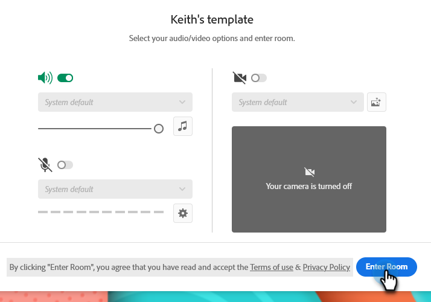

# Mallar för interaktiva webbinarier {#templates-for-interactive-webinars}

Skapa lättanvända mallar i interaktiva webbinarier för att producera innehåll snabbare och i linje med varumärkesriktlinjerna när du arbetar i ett team.

## Bevilja behörigheter {#grant-permissions}

Innan någon användare i organisationen kan komma åt mallar för dina interaktiva webbinarier måste Marketo Engage-administratören först lägga till åtkomst till den eller de roller som du vill ha.

1. Klicka på **[!UICONTROL Admin]** i Marketo Engage.

   

1. Klicka på **[!UICONTROL Users & Roles]** och sedan på fliken **[!UICONTROL Roles]**.

   

1. Dubbelklicka på den roll du vill lägga till behörigheterna i.

   

1. Klicka för att öppna **[!UICONTROL Access Design Studio]**.

   

1. Markera kryssrutan **[!UICONTROL Access Interactive Webinars Templates]**.

   

## Skapa en mall {#create-a-template}

1. Klicka på **[!UICONTROL Design Studio]** i Marketo Engage.

   

1. Klicka på **[!UICONTROL Interactive Webinars]**.

   

1. Klicka på **[!UICONTROL Manage Templates]**.

   

1. En ny flik öppnas. Klicka på **Skapa ny**.

   

1. Välj önskad mall på fliken Standardmallar och klicka sedan på **Nästa**.

   

   >[!NOTE]
   >
   >Organisationsmallar är mallar som du eller ditt team redan har skapat.

1. Ange namn och beskrivning. Klicka på **Spara och öppna**.

   

1. En ny flik öppnas. Om du vill redigera/spara mallen måste du ange ett rum. Eftersom detta inte är ett verkligt webbinarium behöver du inte göra några ljud-/videobildval. Klicka på **Ange rum**.

   

1. Gör eventuella ändringar i den befintliga mallen.

   

1. Välj **Avsluta session för alla** på menyn Avsluta överst till höger.

   

1. Klicka på **Avsluta nu**.

   

Mallen sparas automatiskt.

## Redigera en mall {#edit-a-template}

Följ stegen nedan för att redigera en befintlig mall.

1. Klicka på **[!UICONTROL Design Studio]** i Marketo Engage.

   

1. Klicka på **[!UICONTROL Interactive Webinars]**.

   

1. Klicka på **[!UICONTROL Manage Templates]**.

   

1. En ny flik öppnas. Leta reda på mallen som du vill redigera och klicka på ikonen Öppna.

   

1. En ny flik öppnas. Om du vill redigera mallen måste du ange ett rum. Eftersom detta inte är ett verkligt webbinarium behöver du inte göra några ljud-/videobildval. Klicka på **Ange rum**.

   

1. Gör önskade ändringar i mallen.

   

1. Välj **Avsluta session för alla** på menyn Avsluta överst till höger.

   

1. Klicka på **Avsluta nu**.

   

Ändringarna sparas automatiskt.
