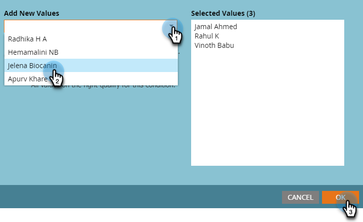

# Hantering av användare och licenser {#user-and-license-management}

Lär dig hur du lägger till och tar bort användare och visar dina aktuella licenser.

## Lägg till en användare {#add-a-user}

1. Gå till **Administratör** område.

   

1. Klicka **Interaktiva webbinarier**.

   

1. Klicka **Lägg till/ta bort användare**.

   

1. Klicka på listrutan Tillgängliga användare, markera de användare som du vill lägga till och klicka på **OK**.

   

## Ta bort en användare {#remove-a-user}

1. Gå till **Administratör** område.

   

1. Klicka **Interaktiva webbinarier**.

   

1. Klicka **Lägg till/ta bort användare**.

   

1. Markera de användare som du vill ta bort och tryck på Delete-tangenten på tangentbordet. Klicka **OK** när det är klart.

   

## Licensanvändning {#license-usage}

Interactive Webinars erbjuder specifika licenser för att skapa event baserade på Adobe Connect. Varje gång en licens läggs till visas en ny ruta för licensanvändning. Marketo-administratörer kan visa (inte redigera) licenserna genom att följa stegen nedan. Kontakta kontogruppen på Adobe (din kontohanterare) för att få ytterligare licenser.

1. Gå till **Administratör** område.

   

1. Klicka **Interaktiva webbinarier**.

   

1. Bläddra ned till License Usage-kortet/korten.

   

<table> 
  <tr> 
   <td><b>Startdatum</b></td>
   <td>Datum då licensen börjar.</td>
  </tr>
  <tr> 
   <td><b>Förfallodatum</b></td>
   <td>Datum när licensen upphör att gälla.</td>
  </tr>
  <tr> 
   <td><b>Typ</b></td>
   <td>Den typ av licens som köpts. Det finns tre typer: Licens för delade händelser, licens för delade rum och ytterligare lagringslicens.</td>
  </tr>
  <tr> 
   <td><b>Händelsekapacitet</b></td>
   <td>Det högsta antalet deltagare som kan inrymmas i en händelse.</td>
  </tr>
  <tr> 
   <td><b>Totalt antal händelser</b></td>
   <td>Det totala antalet händelser som har etablerats med den här licensen.</td>
  </tr>
  <tr> 
   <td><b>Förbrukade händelser</b></td>
   <td>Det totala antalet slutförda händelser.</td>
  </tr>
  <tr> 
   <td><b>Lagringskapacitet</b></td>
   <td>Tillgängligt lagringsutrymme för lagring av inspelningar, säkerheter, hero images, dokumentation och andra tillgångar.</td>
  </tr>
  </tbody>
</table>

**Saker att notera**

* Typen&quot;Additional Storage License&quot; ger just lagring, därför värdet i varje fält _utom_ Lagringskapaciteten listas som &quot;-&quot;.

* Typen &quot;Shared Room License&quot; har obegränsat antal händelser och &quot;Additional Storage License&quot; (Tilläggslicens för lagring) erbjuder bara lagring, så fältet Total Events för dessa licenser listas helt enkelt som &quot;-&quot;.

* Varje gång en händelse skapas räknas den som&quot;förbrukad&quot; från respektive licens (om det inte är en delad rumslicens). &quot;Shared Event License&quot; ges företräde om det finns både &quot;Shared Event License&quot; och &quot;Shared Room License&quot; med samma kapacitet. Om händelsen inte har levererats och om händelseprogrammet tas bort före den schemalagda tiden, fylls antalet händelser på genom att en händelse dras ifrån Använda händelser.

* När en licens har tömts finns dess panel kvar på skärmen Interaktiva webbinarier i administratörsavsnittet där&quot;Totalt antal händelser&quot; och&quot;Använda händelser&quot; har samma värde. Först när licensen upphör att gälla tas den bort från skärmen.
