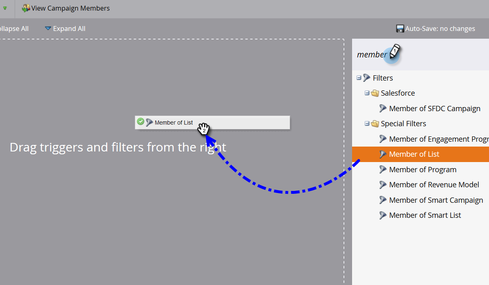

# Lägga till medlemmar i ett händelseprogram {#adding-members-to-an-event-program}

Den här artikeln gäller endast användare som använder Event Cap- eller Event-mål.

>[!CAUTION]
>
>Om du importerar en lista med personer direkt till ett Event Program hindras dessa poster från att räknas i de faktiska registreringarna i rapporten för målspårning och i rapporten om händelseavslut. Följ instruktionerna nedan för att försäkra dig om att dina poster räknas.

1. Skapa och [lägg till personer i en statisk lista](/help/marketo/product-docs/core-marketo-concepts/smart-lists-and-static-lists/static-lists/create-a-static-list.md).

1. [Skapa en smart kampanj](/help/marketo/product-docs/core-marketo-concepts/smart-campaigns/creating-a-smart-campaign/create-a-new-smart-campaign.md).

1. I den smarta listan för den smarta kampanj du skapade i steg två söker du efter och lägger till filtret **Medlem i listan**.

   

1. Sök efter och markera listan som du skapade i steg 1.

   

1. I Flow söker du efter och lägger till flödessteget **Change Program Status**.

   

1. Hitta och välj ditt Event Program.

   

1. Välj önskad status.

   

1. Klicka på **Kör en gång** på fliken Schema.

   

1. Välj **Kör nu** och klicka på **Kör**.

   

1. När den smarta kampanjen körs läggs medlemmarna till i programmet och räknas i beräkningarna för målspårning och händelseavståndsprognos.
