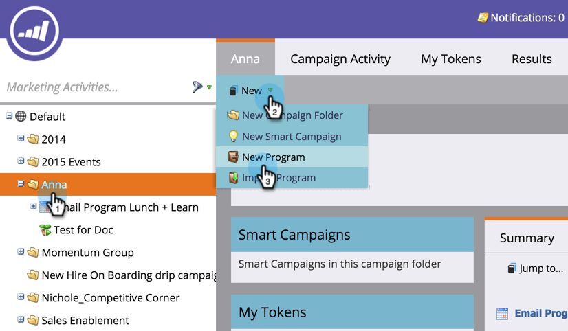

# Skapa ett nytt händelseprogram {#create-a-new-event-program}

Med händelser kan du automatisera online- och offlinehändelser! Fånga personernas status när de går igenom olika faser och få korrekta mått på avkastningen för era marknadsföringssatsningar.

1. Gå till **marknadsföringsaktiviteter**.

   

1. Välj mapp för det nya programmet. Välj **Nytt** och klicka på **Nytt program**.

   

1. Välj ett namn för aktiviteten. Välj sedan **Händelse** under **Programtyp**.

   

1. Välj en **kanal. **

   >[!NOTE]
   >
   >Kanaler definierar de olika statusar en person kan ha i ett program. Läs mer om [programmedlemskap](../../../../product-docs/core-marketo-concepts/programs/creating-programs/understanding-program-membership.md) här.

   

1. Klicka på **Skapa**.

    

1. Om du vill schemalägga din aktivitet väljer du **Schemalägga vy** och klickar på den i kalendern för att öppna popup-fönstret. Ange datum och tid.

   

1. Dra fältet till **Bekräftat** när du är klar.

   

Ta-da! Din nya aktivitet visas nu i trädet. När evenemanget har skapats kan du skapa [landningssidor](../../../../product-docs/demand-generation/landing-pages/free-form-landing-pages/create-a-free-form-landing-page.md), [formulär](../../../../product-docs/demand-generation/forms/creating-a-form/create-a-form.md)och [e-postmeddelanden](../../../../product-docs/email-marketing/email-programs/creating-an-email-program/create-an-email-program.md) för att bjuda in dina gäster! Du kommer också att vilja bekanta dig med [programschemavyn](http://docs.marketo.com/display/docs/program+schedule+view).

>[!NOTE]
>
>**Relaterade artiklar**
>
>* [Marknadsföringskalender](http://docs.marketo.com/display/docs/marketing+calendar)
>* [Använda periodkostnader i ett program](../../../../product-docs/core-marketo-concepts/programs/working-with-programs/using-period-costs-in-a-program.md)

>

