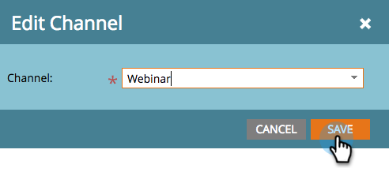

# Redigera en händelsekanal {#edit-an-event-channel}

Du kan redigera kanaltypen från händelsens **Sammanfattning** eller från **Inställningar** -fliken.

>[!NOTE]
>
>Det här alternativet är bara tillgängligt för händelser som inte har associerade medlemmar. När en händelse har medlemmar kan du inte ändra kanaltypen.

>[!NOTE]
>
>Ett program är ett specifikt marknadsföringsinitiativ. The **kanal** är avsett att vara leveransmekanismen, som webbinarium, Tradeshow eller Online Ad. Du kan se olika kanalalternativ i listrutan, beroende på vad som är tillgängligt i din egen instans. Du kan också  [skapa en egen kanal](/help/marketo/product-docs/administration/tags/create-a-program-channel.md).

## På fliken Sammanfattning {#from-the-summary-tab}

1. Från **Marknadsföringsaktiviteter** väljer du din händelse i trädet.

   

1. Navigera till **Sammanfattning** vy.

   

1. Under **Inställningar** väljer du aktuell **Kanal** visas som en hyperlänk.

   

1. Välj en ny kanal i listrutan.

   

1. Klicka **Spara**.

   

## På fliken Inställningar {#from-the-setup-tab}

En ny kanaltyp kan också tilldelas från händelsens **Inställningar** -fliken.

1. Välj din händelse i trädet.

   

1. Navigera till **Inställningar** -fliken. Dubbelklicka på aktuell **Kanal**.

   

1. Välj en ny **Kanal**.

   

1. Klicka **Spara**.

   

Grattis! Du har just redigerat en kanal!
