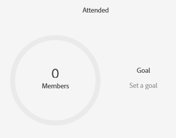

# Ange händelsemål {#setting-event-goals}

Ge evenemangen specifika mål och se hur de fungerar.

>[!IMPORTANT]
>
>Alla har inte köpt den här funktionen. Kontakta Adobe Account Team (din kontoansvarige) för mer information.

1. Skapa ett händelseprogram.

   

1. Välj [!UICONTROL Campaign Folder], ge din händelse en [!UICONTROL Name], välj [!UICONTROL Program Type] och [!UICONTROL Channel]. Klicka på **[!UICONTROL Create]** när du är klar.

   

1. Klicka på fliken **[!UICONTROL Reports]** i din händelse.

   

1. Ange målet för [!UICONTROL Registered] genom att klicka på **[!UICONTROL Set a goal]**. Skriv numret i och tryck på Retur.

   

   

1. Upprepa samma steg för [!UICONTROL Attended].

   

>[!NOTE]
>
>Du kan inte ange mål för en händelse efter att den har startats.

Och det är allt! Kontrollera status för händelsemål genom att klicka på fliken [!UICONTROL Reports].
