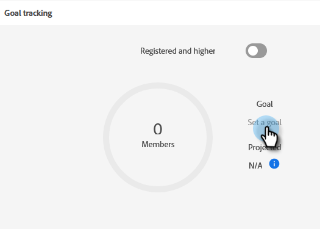

# Ange händelsemål {#setting-event-goals}

Ge evenemangen specifika mål och se hur de fungerar.

>[!IMPORTANT]
>Alla kunder har inte tillgång till den här funktionen. Kontakta din Customer Success Manager för mer information.

1. Skapa ett händelseprogram.

   

1. Välj [!UICONTROL Campaign Folder], ge evenemanget en [!UICONTROL Name]väljer du [!UICONTROL Program Type] och [!UICONTROL Channel]. Klicka **[!UICONTROL Create]** när det är klart.

   

1. Klicka på **[!UICONTROL Reports]** -fliken.

   

1. Ange målet för [!UICONTROL Registered] genom att klicka **[!UICONTROL Set a goal]**. Skriv numret i och tryck på Retur.

   

   

1. Upprepa samma steg för [!UICONTROL Attended].

   

>[!NOTE]
>
>Du kan inte ange mål för en händelse efter att den har startats.

Och det är allt! Kontrollera status för händelsens mål genom att klicka på [!UICONTROL Reports] -fliken.
