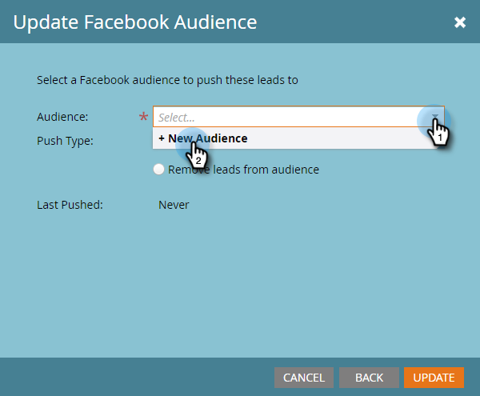

# Skapa en anpassad målgrupp i Facebook {#create-a-custom-audience-in-facebook}

>[!PREREQUISITES]
>
>* [Lägg till anpassade Facebook-målgrupper som en LaunchPoint-tjänst](../../../product-docs/demand-generation/ad-network-integrations/add-facebook-custom-audiences-as-a-launchpoint-service.md) i administratörsavsnittet.
>* [Acceptera Facebooks villkor](https://www.facebook.com/ads/manage/customaudiences/tos.php) för anpassade målgrupper i ditt Facebook-konto.

>

>[!TIP]
>
>Läs mer om [anpassade målgrupper på Facebook](https://www.facebook.com/help/341425252616329).

1. Hitta och välj den smarta eller statiska lista som innehåller de leads du vill skapa målgruppen från.

   

1. Välj fliken **Leads** och klicka sedan på ikonen **Skicka via Ad Bridge **längst ned.

   

1. Välj **Facebook **och klicka på **Nästa**.

   

1. Klicka på listrutan **Målgrupp** och välj **+ Ny publik**.

   

1. Skriv in ett **publiknamn**. Klicka på **Uppdatera**.

   

   >[!NOTE]
   >
   >Om du har flera Facebook-annonskonton visas ytterligare en listruta där du kan välja vilket annonskonto som målgruppen har skapats i.

   >[!TIP]
   >
   >Vill du byta ut en ny publik mot en befintlig som är kopplad till en annonsuppsättning eller grupp? Markera kryssrutan **Ersätt en befintlig målgrupp** . Om du gör det raderas **inte** den målgrupp som ersätts.

1. När du är klar uppdateras statusdialogrutan.

   

   Och det är allt! På Facebook ser du den nya publiken i **Ads Manager > Publiker**.

   

   >[!NOTE]
   >
   >Alla listor som du flyttar över till Facebook blir statiska. Smarta listor i Marketo uppdaterar inte automatiskt målgruppslistan i Facebook så att den återspeglar ändringar som gjorts efter överföringen.

   >[!TIP]
   >
   >Se [Facebooks utbildningsväg för Marketo-kunder](https://facebook.exceedlms.com/student/enrollments/create_enrollment_from_token/BF9TqSaCvM73PP4ScjhCm4fi). Det täcker allt ni behöver veta, från att skapa en Facebook-sida till att målinrikta era Facebook-annonser med hjälp av Marketos annonsnätverksintegreringar.

   >[!NOTE]
   >
   >**Relaterade artiklar**
   >
   >    
   >    
   >    * [Lägg till leads till en anpassad målgrupp på Facebook](add-leads-to-a-custom-audience-in-facebook.md)

