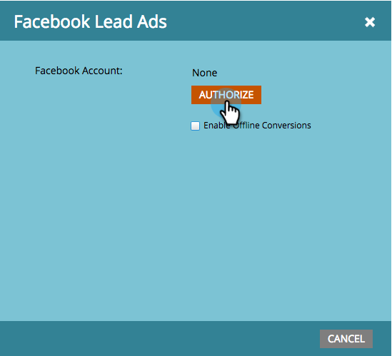

# Konfigurera Facebook-annonser {#set-up-facebook-lead-ads}

Använd [Facebook Lead Ads](https://www.facebook.com/business/ads/ad-objectives/lead-generation){target="_blank"} för att köra annonskampanjer på Facebook och generera leads för Marketo.

>[!NOTE]
>
>* **Administratörsbehörigheter krävs**
>
>* När du skapar formulär för Lead Ads på Facebook ska du kontrollera att formulärnamnet inte bara innehåller numeriska tecken. Formulärnamnet måste vara antingen alfabetiskt eller alfanumeriskt.

>[!AVAILABILITY]
>
>Om du vill lägga till Facebook-annonser i din instans kontaktar du Adobe Account Team (din kontohanterare).

1. Gå till området **Admin** i Marketo Engage.

   

1. Gå till **LaunchPoint**, klicka på listrutan **Nytt** och välj **Ny tjänst**.

   

1. Ange en **[!UICONTROL Display Name]** för tjänsten, välj tjänsten **[!UICONTROL Facebook Lead Ads]** i listrutan och klicka på **[!UICONTROL Create]**.

   

1. Öppna en ny flik i samma webbläsare och gå till [facebook.com](https://www.facebook.com){target="_blank"}. Logga in på Facebook med det konto du vill använda för integreringen.

   >[!NOTE]
   >
   >Kontot [!DNL Facebook] behöver åtkomst till alla [!DNL Facebook]-affärssidor som du vill hämta lead-annonser från.

   

1. När du har loggat in på [!DNL Facebook] går du tillbaka till Marketo och klickar på **[!UICONTROL Authorize]**.

   

1. Om du uppmanas till det klickar du på **[!UICONTROL OK]** för att godkänna Marketo-programinstallationen i [!DNL Facebook].

   

1. Du kommer att märka att du nu är auktoriserad. Klicka på **[!UICONTROL Next]**.

   

1. Markera de sidor du vill att Marketo ska hämta [!UICONTROL Facebook Lead Ads] från och klicka på **[!UICONTROL Next]**.

   >[!TIP]
   >
   >Om du inte ser någon sida som du väntar dig ska du kontrollera att det [!DNL Facebook]-konto som används för att autentisera läggs till på sidan på [!DNL Facebook] och försöka igen.

   

1. Om du vill acceptera standardfältmappningar från [!DNL Facebook] till Marketo klickar du bara på **[!UICONTROL Create]**.

   >[!TIP]
   >
   >Genom att ändra mappningarna kan du anpassa var informationen om annonser för leads lagras i Marketo. Du kan även [hämta in data från anpassade frågor för Lead Ads ](/help/marketo/product-docs/demand-generation/facebook/set-up-facebook-lead-ads/map-custom-fields-to-marketo.md){target="_blank"}.

   >[!CAUTION]
   >
   >Marketo stöder inte mappning av två [!DNL Facebook]-fält till ett enda Marketo-fält, endast 1 till 1. Om du mappar 2 till 1 kan leads misslyckas med att ansluta till Marketo.

   

   Snyggt gjort! Leads börjar flöda in i Marketo när du kör framgångsrika [!DNL Facebook] annonskampanjer för leads.

   

>[!MORELIKETHIS]
>
>* [Tilldela/ta bort behörigheter i hanteraren för leads (Facebook)](https://www.facebook.com/business/help/540596413257598?id=735435806665862){target="_blank"}
>* [Använd filter och utlösare för annonsering på leads i en smart kampanj](/help/marketo/product-docs/demand-generation/facebook/use-lead-ads-filters-and-triggers-in-a-smart-campaign.md){target="_blank"}
>* [Mappa anpassade fält till Marketo](/help/marketo/product-docs/demand-generation/facebook/set-up-facebook-lead-ads/map-custom-fields-to-marketo.md){target="_blank"}
